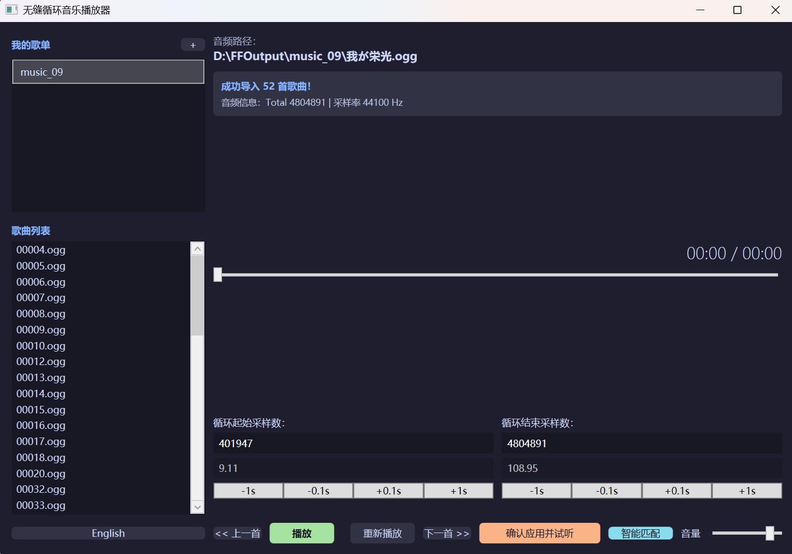

# Seamless Loop Music Player (无缝循环音乐播放器)

[English Version](README_EN.md) | [中文版](README.md)

专注于游戏音乐与环境音效的无缝循环播放工具。
内置 **“波形逆向回溯匹配算法” (Reverse Look-Behind Matching)**，一键实现毫秒级精度的无缝循环点自动对齐。

* **🎛️ 智能匹配 (Smart Match)**: 不需要手动去试那 0.01秒 的差别了。算法会自动分析波形，利用“声音指纹”技术，将循环点对齐到完美位置。
* **🧠 断点续忆**: 关掉软件也没关系，下次打开，它记得你听的是哪首歌（虽然它不会自作主张地吓你一跳自动播放）。
* **🎛️ 智能匹配 (Smart Match)**: 不需要手动去试那 0.01秒 的差别了。算法会自动分析波形，利用“声音指纹”技术，将循环点对齐到完美位置。
* **🧠 断点续忆**: 关掉软件也没关系，下次打开，它记得你听的是哪首歌（虽然它不会自作主张地吓你一跳自动播放）。
* **♾️ 物理无缝**: 基于底层流操控的无缝连接，欺骗声卡驱动，实现真正的 Zero-Gap Loop。
* **🔧 兼容性**: 降级至 .NET Framework 4.8，在 Windows 10/11 上无需安装额外运行库即可解压即用。
* **📂 歌单管理**: 支持文件夹导入，那是必须的。

## 🚀 快速开始

1. 前往 [Releases](https://github.com/CPUrising/seamless-loop-music/releases) 下载最新版本。
2. 解压并运行 `seamless loop music.exe`。
3. 点击“我的歌单”旁的 **“+”** 按钮导入包含 BGM 的文件夹，双击列表中的歌曲进行播放。
4. 填写帧数或秒数，调节微调按钮，按下“确认应用并试听”，跳转到循环终点前3s，粗略设置循环范围，然后点击 **“智能匹配”，**最后按下“确认应用并试听”
5. 戴上耳机，见证无缝循环的奇迹。

## 🕹️ 致敬与灵感 (Acknowledgement)

本项目灵感来源于 [**AokanaMusicPlayer**](https://github.com/melodicule/AokanaMusicPlayer)。
我们在开发初期借鉴了其部分基础架构，谨以最高的敬意感谢 @melodicule 的开源贡献！

在此基础上，我们研发了以下核心技术：

* **智能对齐算法**：引入 SAD (Sum of Absolute Differences) 互相关算法，实现了无需人工干预的自动波形匹配。
* **非破坏性预览**：全新的预览逻辑，只在内存中模拟跳转，不破坏原始播放流。

## 📜 许可证

本项目遵循 **Microsoft Public License (Ms-PL)** 协议开源。
这意味着您可以自由地使用、修改代码，但分发时必须保持开源并附带原协议，且不能以此起诉贡献者专利侵权。

---

*Created with ❤️ by cpu & Lev Zenith*
