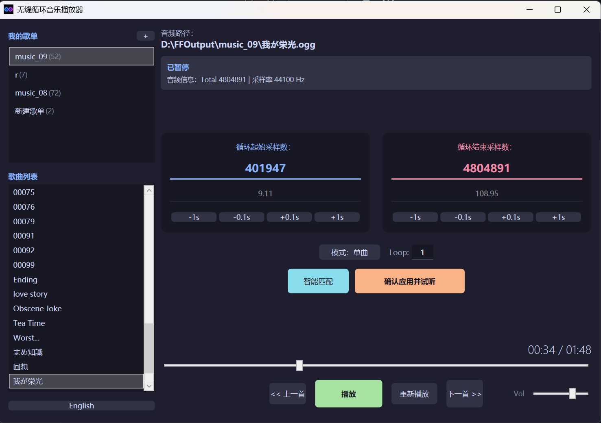

# Seamless Loop Music Player (无缝循环音乐播放器)

[中文版](README.md) | [English Version](README_EN.md)

一款专为游戏 BGM 和环境音效设计的无缝循环播放与配置工具。支持通过音频指纹匹配算法实现精准的循环点自动对齐。

---

## 🛠️ 核心功能

- **音频循环匹配 (Smart Match)**：基于 SAD (Sum of Absolute Differences) 算法。通过分析音频波形相位，自动微调并对齐循环起始点，确保循环处的平滑衔接。
- **数据库驱动的歌单系统**：使用 SQLite 管理歌单。支持音频指纹识别，即使文件位置发生变更，其循环配置、别名等数据也能自动恢复。
- **别名系统**：支持在数据库中为歌曲设定显示名称（DisplayName），无需修改物理文件名。
- **底层流循环控制**：基于 NAudio 实现的环形缓冲区技术，实现采样级别的无间隙循环播放。
- **多样化播放模式**：
  - 支持「单曲循环」、「列表循环」和「随机播放」。
  - 支持设定单曲循环次数上限，达到次数后自动切换至下一曲。
- **低依赖运行**：基于 .NET Framework 4.8 开发，在 Windows 10/11 系统环境下通常无需额外安装运行库。

---

## 🚀 技术规格

- **音频后端**：NAudio
- **数据存储**：SQLite + Dapper (ORM)
- **界面框架**：WPF (支持 UI 虚拟化，适用于大规模列表)
- **算法模型**：时域互相关 (Time-domain Cross-correlation)

---

## 📖 使用指南

1. **导入歌曲**：点击侧边栏“我的歌单”旁的 `+` 号按钮，选择包含音频文件的文件夹。
2. **设置循环范围**：在界面中心区域输入粗略的循环起点和终点采样数。
3. **执行智能匹配**：点击 **“智能匹配”** 按钮。程序将分析终点附近的波形，并在起点附近寻找最匹配的采样位置进行自动更新。
4. **应用并验证**：点击 **“应用并试听”**，播放器将跳转至循环终点前 3 秒以便用户验证衔接效果。

---

## 📝 开发计划 (Roadmap)

我们致力于打造极致的无缝循环体验，以下是正在进行及计划中的改进：

### 🔴 优先修复 (High Priority)

- [ ] **爆音消除优化**：进一步研究音频跳转瞬间的采样平滑算法，解决特定的 "Click/Pop" 噪声。
- [ ] **智能检测**：增加对系统音频设备拔插（如耳机断开）的监听，实现自动暂停。

### 🟡 体验升级 (UX Improvements)

- [ ] **UI 交互优化**：美化主界面视觉样式，并重构歌单管理与曲目添加界面的交互逻辑，提升易用性。
- [ ] **交叉淡入淡出 (Crossfade)**：在切换歌曲时实现平滑的音量过渡，该功能将作为可选开关供用户配置。
- [ ] **列表自动联动**：播放切换时，歌单列表自动滚动并定位至当前正在播放的曲目。

### 🔵 算法与性能 (Algorithm & Performance)

- [ ] **匹配算法升级**：引入更高效的波形分析方式（如 FFT 互相关），缩短智能匹配的计算耗时并提升跨格式精度。
- [ ] **正向搜索支持**：除目前的逆向匹配外，增加从循环起点向后的正向匹配逻辑，适配更多样化的音频结构。

---

## 🕹️ 致敬

本项目灵感来源于 AokanaMusicPlayer。
我们在此基础上进行了全方位的架构重构与功能增强，旨在提供更现代、更稳定的音频循环解决方案。

---

## 📜 许可证

本项目遵循 **Microsoft Public License (Ms-PL)** 协议。
