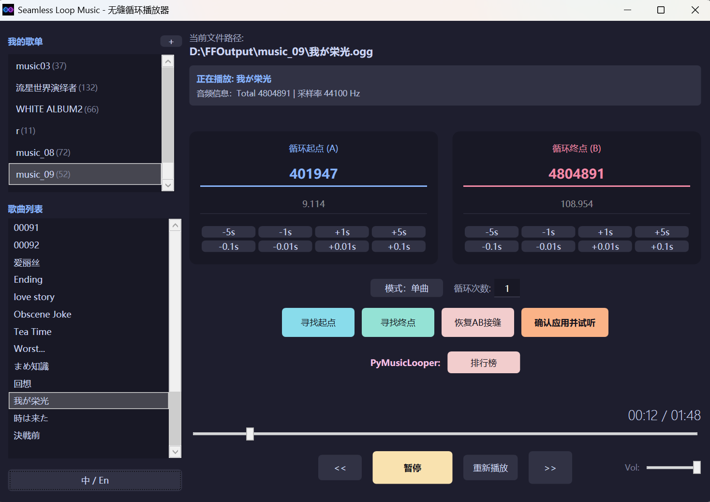

# Seamless Loop Music Player (无缝循环音乐播放器)

[中文版](README.md) | [English Version](README_EN.md)

一款专为游戏 BGM（如 Galgame、RPG）及环境音效（如白噪音）打造的无缝循环播放与高效管理工具。依托自研算法与顶级开源引擎双重驱动，实现采样级的精准循环对齐。

目前支持win10及以上的操作系统

---

## 🛠️ 核心功能

### 1. 智能循环对齐 (Smart & Deep Match)

- **手动智能匹配**：支持“寻找起点” (Reverse) 与“寻找终点” (Forward) 两种模式，完美适配 Intro+循环节+循环节开头一部分 的 OST 音轨。
  寻找起点：以当前循环终点的前一秒为指纹，在当前循环起点的前后共10秒寻找匹配程度最高处，将此处更新为循环起点
  寻找终点：以当前循环起点的后一秒为指纹，在当前循环终点的前后共10秒寻找匹配程度最高处，将此处更新为循环终点
- **自动智能匹配**：集成业界领先的极致匹配引擎PyMusicLooper，使得可以批量一键匹配循环点（需要用户先自行安装）

### 2. A/B 拼接模式 (A/B Looping)

- **双文件合体**：支持将两个独立的音轨（如 Intro.wav + Loop.wav，01_a.ogg+01_b.ogg，02_A.mp3+02_B.mp3）逻辑拼接为单曲播放，适用于白色相簿2、流星世界演绎者的游戏原始BGM匹配
  但是因为采取了把两首歌直接吞进内存里进行操作的方式，所以A\B段**不要**使用长达**几个小时**的音乐文件，这只会让你的电脑红温。
- 用户可以自己设置合并后的循环起始点，同时可以通过“恢复AB接缝”恢复AB的原始循环

### 3.三种播放模式

- 支持单曲循环
- 支持列表循环播放与列表随机播放，同时可以修改循环次数，自定义循环几次切换到下一首歌。

### 4. 持久化数据管理 (Safe & Portable)

- **指纹识别系统**：基于 `(文件名 + 总采样数)` 的音频指纹技术。即使移动文件位置，其别名、循环配置也能自动找回。
- **工业级后端**：基于 SQLite + Dapper 架构，开启 WAL 并发模式，支持大规模曲库的高速读写与管理。
- **别名系统**：支持在不修改物理文件名的前提下，在 UI 界面自定义显示名称。

### 5. 现代交互体验 (UX & Interaction)

- **原生拖拽重排**：支持在歌单和曲目列表中直接拖拽调整顺序，排序结果实时持久化到数据库。
- **批量管理引擎**：支持多选歌单执行一键刷新、批量极致匹配及删除操作。
- **智能边缘滚动**：长列表拖拽时自动感知边界并自动滚动，操作顺滑。

---

## 🚀 技术栈

- **音频后端**：NAudio (基于环形缓冲区的无缝流技术)
- **数据存储**：SQLite + Dapper (ORM)
- **界面框架**：WPF (支持 UI 虚拟化与动态列表重绘)
- **匹配算法**：时域互相关 (自研) + PyMusicLooper (集成)

---

## 📖 使用指南

1. **批量操作的解释**：同windows多选文件的操作，即CTRL单个多选，CTRL+A列表内全选，shift选范围
2. **导入**：点击左上方“我的歌单”右侧的 `+` 号添加歌单，歌单有两种：一种只能通过添加删除文件夹管理，另一种只能通过添加删除单个系统会自动扫描并建立指纹映射。
3. **自动匹配**：
   **手动智能匹配**：在主界面输入或按钮修改得到粗略采样点或时间，利用“寻找起点/终点”进行局部相位对齐，通过“确认并试听”跳转到循环终点前3秒比对是否无缝

   **极致匹配**：首先需要配置好PyMusicLooper，参见[[PyMusicLooper/README.md at master · arkrow/PyMusicLooper](https://github.com/arkrow/PyMusicLooper/blob/master/README.md)](https://github.com/arkrow/PyMusicLooper)
   或看本文档使用指南的第5点。

   可以批量选择歌曲进行“极致匹配”，让引擎自动为你寻找最佳循环节位置，然后点击排行榜，在排行榜界面双击选择循环点试听选择。如果这首歌还没有极致匹配过，点击排行榜后，会先对这首歌极致匹配，再进入排行榜界面。
   经实际测试，极致匹配不一定准确，可能还需要用户自行手动调整。

   **A\B段匹配**：歌单添加歌曲时，就会自动设置循环起始点为B段的开头结尾，也支持上述两种匹配方式。如果要恢复原循环起始点，可按下“恢复A\B接缝”回到最初状态。

   **匹配问题**：小概率所取的循环点位置不易解码，导致不能正常循环，如过了循环点直接回到歌曲开头停止。此时微调循环点几毫秒即可解决。
4. **歌单歌曲管理**：
   歌单分为两类：一种只能通过添加删除文件夹管理，另一种只能通过添加删除单个（或歌单里批量选中的）歌曲管理。
   右键歌单或歌曲进行相应管理操作，删除，重命名，添加歌单，
   支持列表中左键拖拽歌曲，排列你喜欢的播放顺序。
5. **PyMusicLooper安装教程**：
   **uv版：**

   安装时“网络环境”要求较高，尤其是uv工具的安装。我写下这句话时，真希望所有人都是程序员，或至少懂得双引号内含义。

   先进入powershell,输入powershell -ExecutionPolicy ByPass -c "irm https://astral.sh/uv/install.ps1 | iex"，等待下载完成，安装时“网络环境”要求较高。下载完成后

   win+R,输入cmd,打开cmd终端，输入uv tool install pymusiclooper，下载。这一步对国内网络要求似乎小一点。完成后。。。

   嗯，就可以匹配了。

   问题主要在于uv工具的安装。应该也可以通过python的pip安装，只是我目前不会清理之前安装PyMusicLooper的环境变量，而且我的python环境有点乱，这些会对pip安装造成干扰，所以没有尝试。但根据原仓库文档，应当可以。

   **pip版：**
   如果已经配置好pip，就进入第二步，几乎一样：
   pipx install pymusiclooper或
   pip install pymusiclooper

---

## 🕹️ 致敬

本项目最初的灵感与开发动力来源于 [melodicule/AokanaMusicPlayer: 苍彼音乐无缝播放/Play Aokana&#39;s BGM seamless](https://github.com/melodicule/AokanaMusicPlayer)，其中循环相关代码对我们后期AB段的处理有很大的启发（直接把歌曲吞进内存...）
我们在其基础上进行了扩展与增强，使得具有更加广泛的应用

本项目的批量极致匹配，由业界领先超级无敌神通广大无所不能的自动寻找循环节的开源项目[arkrow/PyMusicLooper: A python program for repeating music endlessly and creating seamless music loops, with play/export/tagging support.](https://github.com/arkrow/PyMusicLooper)提供支持，请大家给这个仓库一个大大的star！

---

## 📜 许可证

本项目尊敬[melodicule/AokanaMusicPlayer: 苍彼音乐无缝播放/Play Aokana&#39;s BGM seamless](https://github.com/melodicule/AokanaMusicPlayer)的开源贡献，根据其协议遵循 **Microsoft Public License (Ms-PL)** 协议。
