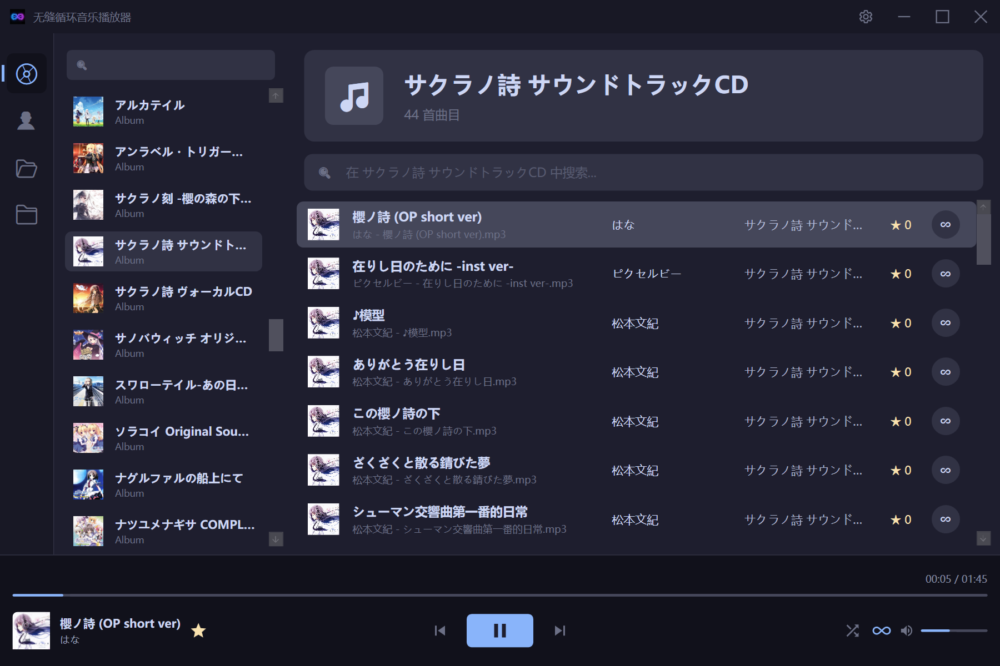
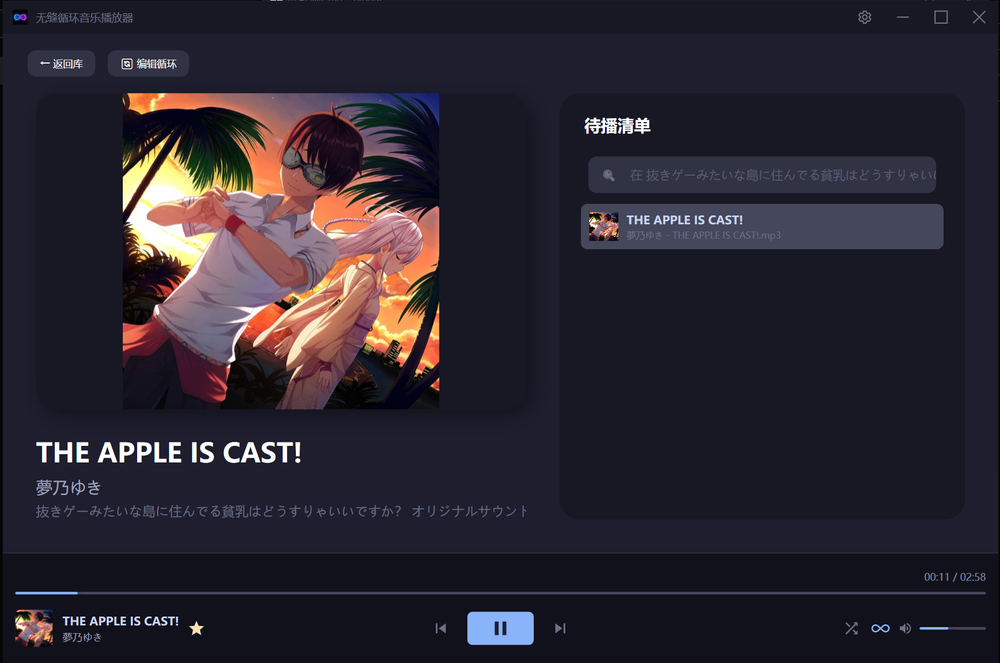
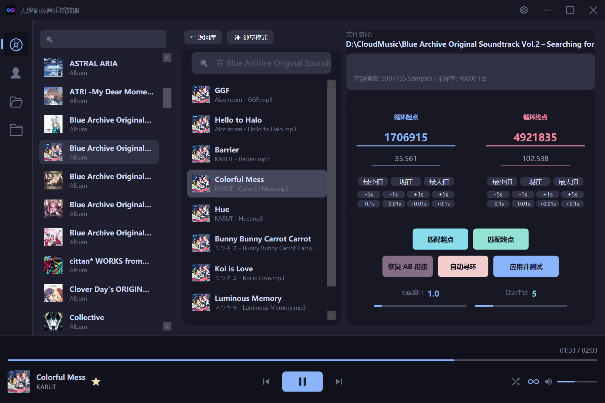

# Seamless Loop Music Player (无缝循环音乐播放器)

[中文版](README.md) | [English Version](README_EN.md)

一款专为游戏 BGM（如 Galgame、RPG）及环境音效（如白噪音）打造的无缝循环播放与管理工具。通过自研算法与开源引擎双重驱动，实现采样级的精准循环对齐。

**运行环境**：Windows 10 及以上
**支持格式**：MP3, OGG, WAV, FLAC

---

## 🛠️ 技术栈

- **音频引擎**：NAudio + BunLabs.NAudio.Flac (基于环形缓冲区的无缝流处理技术)
- **开发框架**：WPF + Prism (MVVM) + Unity (依赖注入)
- **数据管理**：SQLite + Dapper (开启 WAL 并发模式)
- **核心算法**：时域互相关 (自研) + PyMusicLooper (集成)

---

## 🚀 核心功能

### 1. 智能循环对齐 (Smart Match)

针对具有“开场白 + 循环节”结构的音轨，提供两种相位对齐模式：

- **寻找起点 (Reverse Match)**：以当前终点前几秒为指纹，在起点附近寻找匹配度最高的位置并自动更新。
- **寻找终点 (Forward Match)**：以当前起点后几秒为指纹，在终点附近寻找匹配度最高的位置并自动更新。
- **自动寻环**：集成对 `PyMusicLooper` 进行C++重写的音频分析引擎，支持一键自动化分析并给出候选方案。

### 2. A/B 逻辑拼接 (A/B Splicing)

支持将两个独立音轨（如 `Intro.wav` + `Loop.wav`）逻辑拼接为单曲。

- 适用于提取自游戏原始资源中分离的 Intro 和 Loop 片段。
- 支持自定义合并后的循环点，并提供“恢复 A/B 接缝”功能以还原原始状态。
- 但是两个片段必须放在同一文件夹才可以识别，进行逻辑拼接

### 3. 无缝播放系统

- **无缝循环模式**：开启后，播放器在到达循环终点时将实现采样级跳转。
- **常规模式切换**：支持普通播放与无缝循环的快速切换，适配不同收听需求。

### 4. 健壮的数据管理

- **音频指纹系统**：基于“文件名 + 总采样数”生成指纹。即使移动文件位置或重命名，其循环配置、别名和歌单信息也能自动找回。
- **数据库同步**：支持同步其他设备的数据库文件。系统会以指纹为依据，自动覆盖或更新本机的循环点及元数据。
- **别名系统**：支持在不修改物理文件名的前提下自定义 UI 显示名称。

---

## 📖 使用指南

### 1. 导入与扫描

点击主界面“设置（齿轮）”，添加音乐所在文件夹后点击“立即扫描”。系统将自动提取元数据。

### 2. 匹配循环点

点击列表歌曲右侧的**循环图标（倒8字 ∞）**进入编辑界面：

- **手动对齐**：输入或通过按钮调整大致采样点，利用“匹配起点/终点”进行局部对齐。点击“确认并试听”可跳转至终点前 3 秒以验证衔接效果。
- **参数微调**：支持修改“匹配长度”与“搜索半径”，以更改匹配的范围。

### 3. 自动寻环 (PyMusicLooper)

1. **分析**：在单曲编辑界面或批量选择歌曲后选择“自动寻环”，引擎将计算最佳循环位置。
2. **选择**：在自动寻环的“排行榜”界面双击不同方案进行试听，确认后保存。
   *注意：自动寻环结果受算法限制，可能仍需手动微调。*

---

## ⚠️ 注意事项

- **命名规范**：歌曲名请避免使用乱码，以免跨设备同步时产生识别错误。建议先将文件名修改为标准字符。
- **分类逻辑**：系统目前按“专辑名”进行归类，同名专辑将被视为同一集合。
- **解码异常**：若遇到循环点位置无法正常解码（如跳转后停止），请尝试微调循环点数毫秒。

---

## 🕹️ 致敬与引用

- [AokanaMusicPlayer](https://github.com/melodicule/AokanaMusicPlayer)：该项目是本项目的灵感来源，提供了最基本的无缝循环的思路
- [PyMusicLooper](https://github.com/arkrow/PyMusicLooper)：该项目曾经是自动寻环的核心依赖，后来[**daititii**](https://github.com/daititii)对此用C++重写，大大加快了分析速度，并且无需再安装python库

---

## 📜 许可证

本项目遵守 **MIT** 协议。
