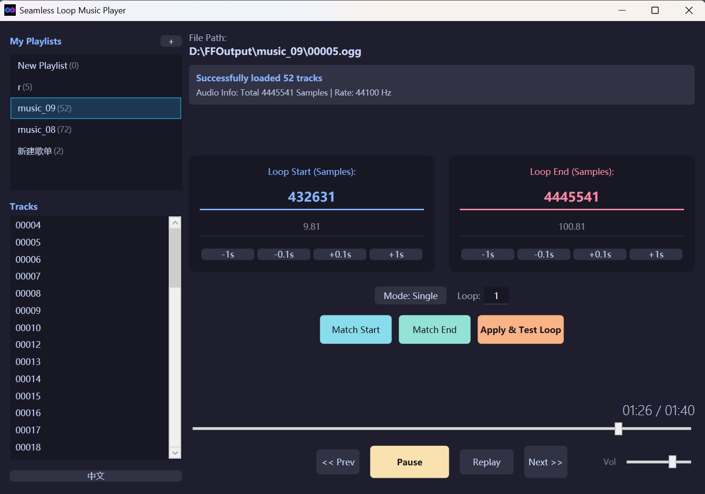

# Seamless Loop Music Player

[中文版](README.md) | [English Version](README_EN.md)

A specialized tool for seamless looping and configuration of game BGM and ambient sound effects. Features millisecond-precision auto-alignment of loop points via an audio fingerprint matching algorithm.

---

## 🛠️ Key Features

- **Smart Match (Audio Loop Alignment)**: Based on the SAD (Sum of Absolute Differences) algorithm. Automatically fine-tunes and aligns the loop start point by analyzing waveform phases to ensure smooth transitions.
- **Database-Driven Playlist System**: Managed via SQLite. Supports audio fingerprinting to automatically restore loop configurations, aliases, and other metadata even if file locations change.
- **Alias System**: Allows setting custom display names (DisplayName) for tracks in the database without modifying physical filenames.
- **Low-Level Stream Loop Control**: Utilizes NAudio-based circular buffering for sample-accurate, gapless looping.
- **Diverse Playback Modes**:
  - Supports "Single Cycle", "List Loop", and "Shuffle".
  - Configurable loop count limit per track before automatically switching to the next.
- **Low Dependency**: Built on .NET Framework 4.8, typically requiring no additional runtime installation on Windows 10/11.

---

## 🚀 Technical Specifications

- **Audio Backend**: NAudio
- **Data Storage**: SQLite + Dapper (ORM)
- **UI Framework**: WPF (with UI Virtualization for large-scale lists)
- **Algorithm Model**: Time-domain Cross-correlation

---

## 📖 User Guide

1. **Import Tracks**: Click the `+` button next to "My Playlists" in the sidebar to select a folder containing audio files.
2. **Set Loop Range**: Enter approximate loop start and end points (in samples) in the central workspace.
3. **Execute Smart Match**: Click the **"Smart Match"** button. The program analyzes the waveform near the end point and searches for the best matching position near the start point for automatic calibration.
4. **Apply and Verify**: Click **"Apply & Test Loop"**. The player will jump to 3 seconds before the loop end point for you to verify the transition quality.

---

## 📝 Roadmap

We are committed to delivering the ultimate seamless loop experience. Here are our planned improvements:

### 🔴 High Priority

- [ ] **Pop Noise Elimination**: Further research on sample smoothing algorithms during jumps to eliminate specific "Click/Pop" noises.
- [ ] **Smart Detection**: Monitor system audio device changes (e.g., headphone disconnection) to implement auto-pause.

### 🟡 UX Improvements

- [ ] **UI/UX Optimization**: Refine the visual style and refactor playlist management and track addition workflows for better usability.
- [ ] **Crossfade**: Implement smooth volume transitions between tracks as a user-configurable option.
- [ ] **Auto-Focus List**: Automatically scroll the playlist to focus on the currently playing track.

### 🔵 Algorithm & Performance

- [ ] **Algorithm Upgrade**: Introduce more efficient waveform analysis methods (e.g., FFT cross-correlation) to reduce computation time and improve cross-format accuracy.
- [ ] **Forward Search Support**: Implement matching logic searching forward from the start point to accommodate diverse audio structures.

---

## 🕹️ Acknowledgement

This project is inspired by AokanaMusicPlayer. We have fully refactored its architecture and enhanced its features to provide a more modern and stable audio looping solution.

---

## 📜 License

This project is licensed under the **Microsoft Public License (Ms-PL)**.
