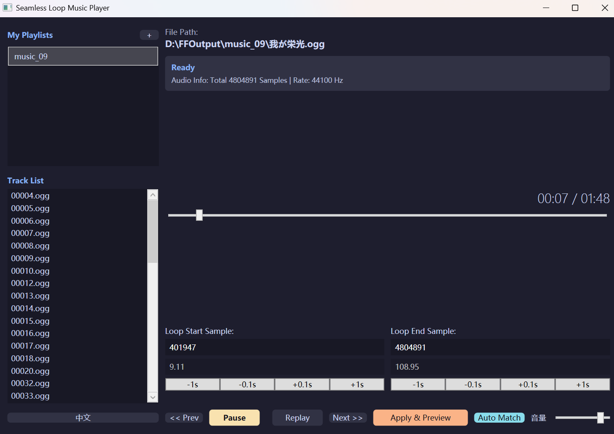

# ⚠️ Project Migration Notice

**I have decided to abandon this WPF version! (╯°□°）╯︵ ┻━┻**

In order to achieve the grand goal of **Windows + Android + iOS domination**, development on this project will cease.
We are taking the core algorithms (seamless looping, smart waveform matching) with us to **Flutter**, starting a brand new cross-platform chapter.

The new legend will continue there...

---

# Seamless Loop Music Player

[中文版](README.md) | [English Version](README_EN.md)

A specialized tool designed for seamless looping of game music and ambient tracks.
Featuring the built-in **"Reverse Look-Behind Matching Algorithm"**, it achieves millisecond-precision auto-alignment for loop points with a single click.

* **🎛️ Smart Match**: No more manual tweaking for that 0.01s difference. The algorithm automatically analyses the waveform and uses "Audio Fingerprinting" technology to align loop points to the perfect position.
* **🧠 Breakpoint Memory**: Close the app anytime. It remembers which track you were listening to when you open it next time (though it won't startle you by auto-playing).
* **♾️ Physical Seamlessness**: Zero-Gap Loop based on low-level stream manipulation, tricking the sound driver into perceiving a continuous stream.
* **🔧 Compatibility**: Downgraded to .NET Framework 4.8, ready to use on Windows 10/11 after unzipping, without extra runtime installation.
* **📂 Playlist Management**: Support for folder import is a must.

## 🚀 Quick Start

1. Go to [Releases](https://github.com/CPUrising/seamless-loop-music/releases) to download the latest version.
2. Unzip and run `seamless loop music.exe`.
3. Click the **"+"** button next to "My Playlists" to import a folder containing BGMs, and double-click a song in the list to play.
4. Fill in frames or seconds, adjust with fine-tune buttons, press "Apply & Preview" to jump to 3s before loop end, roughly set a loop range, then click **"Smart Match"**, and finally press "Apply & Preview".
5. Put on your headphones and witness the miracle of seamless looping.

## 📝 Roadmap

We are dedicated to creating the ultimate seamless loop experience. Here are the improvements currently in progress or planned:

### 🔴 High Priority
- [ ] **Stability Enhancement**: Resolve occasional crashes and implement a global exception handling mechanism.
- [ ] **Eliminate Popping**: Deeply optimize waveform processing during jumps to completely eliminate occasional "Click/Pop" noises.
- [ ] **Singleton Mode**: Restrict the application to a single instance to prevent audio output conflicts.
- [ ] **Smart Detection**: Add detection for playback device hot-plugging (e.g., unplugging headphones) to automatically pause playback.

### 🟡 UX Improvements
- [ ] **Visualization Optimization**: Optimize the timeline and unit display to make fine-tuning more intuitive.
- [ ] **List Experience**: Automatically scroll the playlist to the current song when switching tracks.
- [ ] **Easy Import**: Support adding playlists by directly inputting path addresses.
- [ ] **Metadata Editing**: Support correcting song display names within the software.
- [ ] **Algorithm Upgrade**: Enhance matching precision for short loop segments (<1s) and support forward (Start -> End) search.

### 🔵 Future Plans
- [ ] **AB Loop Support**: Adapt to the Intro + Loop (AB segment) looping structure.
- [ ] **Advanced Filtering**: Support filtering the list based on game metadata.

## 🕹️ Acknowledgement & Inspiration

This project is inspired by [**AokanaMusicPlayer**](https://github.com/melodicule/AokanaMusicPlayer).
We gratefully acknowledge the foundational architecture provided by @melodicule's open-source work with our highest respect!

Building upon that foundation, we have developed the following core technologies:

* **Smart Alignment Algorithm**: Introduced SAD (Sum of Absolute Differences) cross-correlation algorithm, achieving automated waveform matching without human intervention.
* **Non-Destructive Preview**: A brand new preview logic that simulates jumps only in memory without disrupting the original playback stream.

## 📜 License

This project is open-sourced under the **Microsoft Public License (Ms-PL)**.
This means you are free to use and modify the code, but you must keep it open-source and include the original license when distributing, and you cannot sue contributors for patent infringement based on this.

---

*Created with ❤️ by cpu & Lev Zenith*
