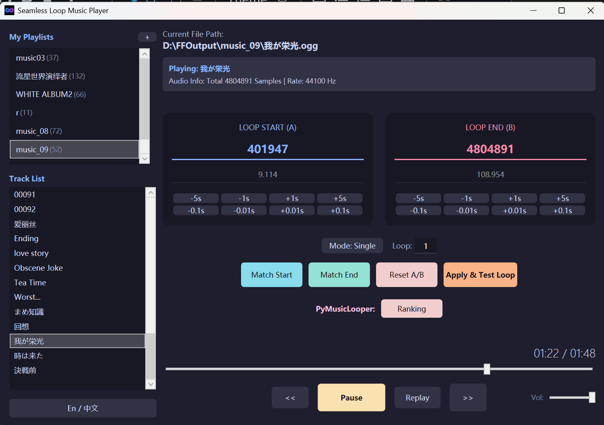

# Seamless Loop Music Player

[中文版](README.md) | [English Version](README_EN.md)

A seamless looping and high-efficiency management tool crafted for game BGM (such as Galgames and RPGs) and ambient sound effects (such as white noise). Powered by both self-developed algorithms and top-tier open-source engines, it achieves precise sample-level loop alignment.

Currently supports Windows 10 and above operating systems.

---

## 🛠️ Core Features

### 1. Smart & Deep Match

- **Manual Smart Match**: Supports "Reverse" (find start) and "Forward" (find end) modes, perfectly adapted to OST tracks with Intro + Loop Section + Loop Section Start.
  - **Reverse**: Uses the one second before the current loop end as a fingerprint, searching for the highest match within 10 seconds around the current loop start to update it.
  - **Forward**: Uses the one second after the current loop start as a fingerprint, searching for the highest match within 10 seconds around the current loop end to update it.
- **Automatic Smart Match**: Integrated with the industry-leading PyMusicLooper engine, allowing for one-click batch loop point matching (requires manual installation by the user).

### 2. A/B Looping Mode

- **Dual-File Concatenation**: Supports logically concatenating two independent tracks (e.g., Intro.wav + Loop.wav, 01_a.ogg + 01_b.ogg, 02_A.mp3 + 02_B.mp3) into a single playable track. This is ideal for original game BGM matching like White Album 2 or Meteor World Actor.
  - *Note*: Since the implementation loads both files directly into memory, **do not** use audio files that are **several hours long**, as this may cause high system temperature.
- Users can manually set the merged loop start and end points, or restore the original A/B seam via the "Restore A/B Seam" button.

### 3. Three Playback Modes

- Supports Single Track Loop.
- Supports Playlist Loop and Random Playback, with customizable loop counts per track before switching to the next one.

### 4. Persistence Data Management (Safe & Portable)

- **Fingerprint Identification**: Audio fingerprinting technology based on `(Filename + Total Samples)`. Aliases and loop configurations are automatically recovered even if files are moved.
- **Industrial-Grade Backend**: Built on SQLite + Dapper architecture with WAL concurrency mode enabled, supporting high-speed read/write for large music libraries.
- **Alias System**: Customize display names in the UI without modifying physical filenames.

### 5. Modern UX & Interactivity

- **Native Drag-and-Drop**: Directly drag music tracks or playlists to reorder them; results are persisted to the database in real-time.
- **Batch Management Engine**: Multi-select playlists to perform one-click refresh, batch deep matching, or deletion.
- **Smart Edge Scrolling**: Automatically senses boundaries and scrolls when dragging in long lists for a smooth experience.

---

## 🚀 Tech Stack

- **Audio Backend**: NAudio (Seamless streaming technology based on ring buffers)
- **Data Storage**: SQLite + Dapper (ORM)
- **UI Framework**: WPF (Supports UI virtualization and dynamic list redrawing)
- **Matching Algorithms**: Time-domain cross-correlation (Custom) + PyMusicLooper (Integrated)

---

## 📖 User Guide

1. **Batch Operations**: Similar to Windows file selection: `CTRL` + Click for multiple individual selections, `CTRL+A` for selecting all in a list, and `Shift` + Click for range selection.
2. **Importing**: Click the `+` icon next to "My Playlists" in the upper-left corner. There are two types of playlists: one managed only by adding/deleting folders, and another managed by individual tracks which the system automatically scans and maps via fingerprints.
3. **Loop Matching**:
   - **Manual Smart Match**: Input or use buttons on the main interface to get rough sample points or timestamps. Use "Find Start/End" for local phase alignment. Use "Confirm and Preview" to jump to 3 seconds before the loop end to verify seamlessness.
   - **Deep Match**: Requires PyMusicLooper to be configured. Refer to [arkrow/PyMusicLooper](https://github.com/arkrow/PyMusicLooper/blob/master/README.md) or point 5 in this guide.
     - You can batch-select songs for "Deep Match". The engine will find the best loop positions. Double-click an entry in the "Leaderboard" to preview and select. If a song hasn't been matched yet, clicking the leaderboard will trigger the matching process first.
     - *Tested Tip*: Deep matching isn't always 100% accurate; manual fine-tuning might still be needed.
   - **A/B Segment Matching**: When adding A/B tracks, the loop start/end is automatically set to the beginning/end of the B segment. It also supports the two matching methods mentioned above. Use "Restore A/B Seam" to return to the initial state.
   - **Looping Issues**: In rare cases, the chosen loop point might be difficult to decode, causing a failure (e.g., stopping or returning to the start). Fine-tuning the loop point by a few milliseconds usually solves this.
4. **Playlist & Song Management**:
   - Right-click playlists or songs for operations like delete, rename, or add.
   - Drag and drop tracks with the left mouse button to arrange your preferred play order.
5. **PyMusicLooper Installation Guide**:
   - **uv Version (Recommended):**
     - Requires a stable network environment, especially for installing the `uv` tool.（those reading *here* don't need worry about it）
     - Open PowerShell and run: `powershell -ExecutionPolicy ByPass -c "irm https://astral.sh/uv/install.ps1 | iex"`.
     - Once installed, open CMD (Win+R -> cmd) and run: `uv tool install pymusiclooper`.
   - **pip Version:**
     - If you have Python and `pip` configured, run: `pipx install pymusiclooper` or `pip install pymusiclooper`.

---

## 🕹️ Credits

This project was initially inspired by [melodicule/AokanaMusicPlayer](https://github.com/melodicule/AokanaMusicPlayer). The loop-related code provided great inspiration for our A/B segment processing (loading the entire song into memory...). We have expanded and enhanced it for broader applications.

Batch Deep Matching is supported by [arkrow/PyMusicLooper](https://github.com/arkrow/PyMusicLooper), an incredible open-source project for finding seamless loops. Please give them a star!

---

## 📜 License

This project respects the open-source contributions of [melodicule/AokanaMusicPlayer](https://github.com/melodicule/AokanaMusicPlayer) and follows the **Microsoft Public License (Ms-PL)**.
