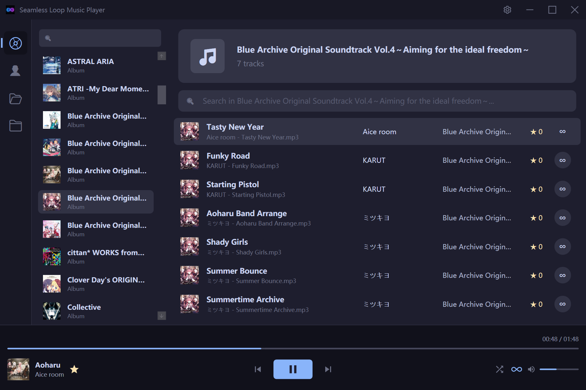
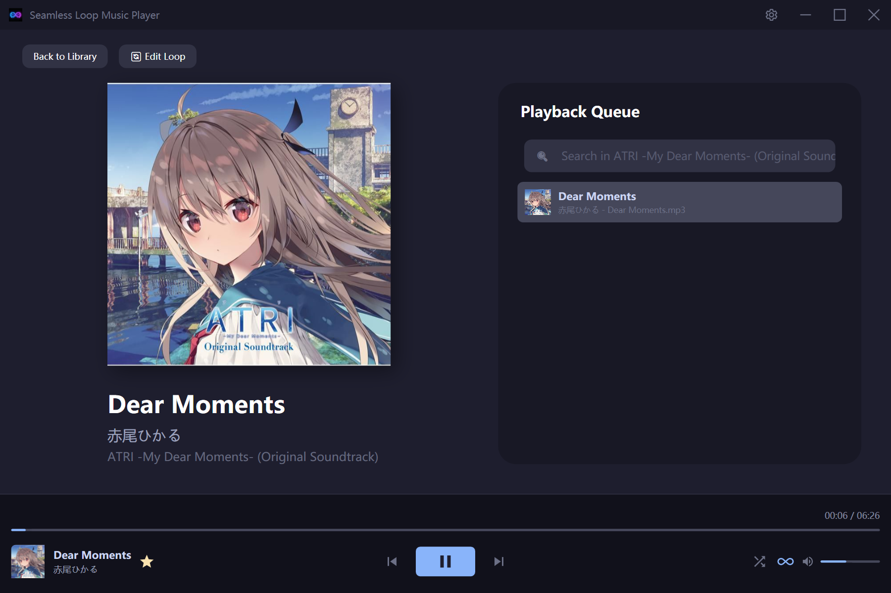
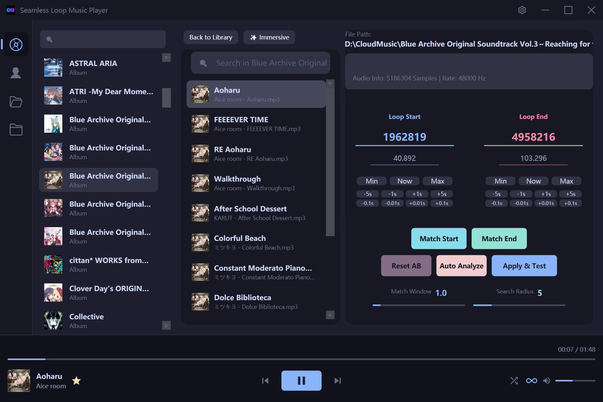

# Seamless Loop Music Player

[中文版](README.md) | [English Version](README_EN.md)

A specialized management and playback tool designed for seamless looping of game BGM (e.g., Visual Novals, RPGs) and ambient sounds (e.g., white noise). Powered by both proprietary algorithms and open-source engines, it achieves precise sample-level loop alignment.

**Environment**: Windows 10 or above  
**Supported Formats**: MP3, OGG, WAV

---

## 🛠️ Tech Stack

- **Audio Engine**: NAudio (Seamless streaming based on circular buffering)
- **Framework**: WPF + Prism (MVVM) + Unity (Dependency Injection)
- **Data Management**: SQLite + Dapper (WAL mode enabled)
- **Core Algorithms**: Time-domain Cross-correlation (Proprietary) + PyMusicLooper (Integrated)

---

## 🚀 Core Features

### 1. Smart Match
Provides two phase-alignment modes for tracks with an "Intro + Loop" structure:
- **Reverse Match**: Uses the last few seconds before the current end as a fingerprint to find the best matching position near the start point.
- **Forward Match**: Uses the first few seconds after the current start as a fingerprint to find the best matching position near the end point.
- **Extreme Search**: Integrated with the `PyMusicLooper` engine for automated one-click analysis and candidate generation. (Requires manual installation; see the Usage section for details or visit the [PyMusicLooper](https://github.com/arkrow/PyMusicLooper) project).

### 2. A/B Splicing (A/B Splicing)
Supports logically concatenating two independent tracks (e.g., `Intro.wav` + `Loop.wav`) into a single playable song.
- Ideal for original game assets where Intro and Loop are stored separately.
- Supports custom loop points for merged tracks and provides a "Restore A/B Seam" function.

### 3. Seamless Playback System
- **Seamless Loop Mode**: When enabled, the player performs sample-level jumps when reaching the loop end.
- **Mode Switching**: Quickly toggle between seamless looping and standard playback to suit your listening needs.

### 4. Robust Data Management
- **Audio Fingerprinting**: Generates fingerprints based on "Filename + Total Samples." Loop configurations, aliases, and playlist info are automatically recovered even if files are moved or renamed.
- **Database Sync**: Supports syncing database files from other devices. The system identifies tracks via fingerprints and automatically updates local loop points and metadata.
- **Alias System**: Customize display names in the UI without modifying physical filenames.

---

## 📖 Usage Guide

### 1. Import and Scan
Click the **Settings (Gear)** icon, add the music folder, and click "Scan Now." The system will extract metadata and generate audio fingerprints.

### 2. Loop Point Matching
Click the **Loop Icon (∞-shaped)** on the right side of a track in the list:
- **Manual Alignment**: Enter or adjust rough sample points, then use "Match Start/End" for local alignment. Click "Confirm & Audition" to jump to 3 seconds before the end to verify the transition.
- **Fine-tuning**: Adjust "Match Length" and "Search Radius" to change the algorithm's matching range.

### 3. Automatic Search (PyMusicLooper)
1. **Analysis**: Select tracks in batch and choose "Auto Search." The engine will calculate the best loop positions.
2. **Selection**: Double-click candidates in the "Ranking List" to audition and save the best one.
*Note: Results are algorithm-dependent; manual fine-tuning may still be required for complex tracks.*

### 4. PyMusicLooper Installation
You can visit the [PyMusicLooper](https://github.com/arkrow/PyMusicLooper) project page or use one of the following methods:

#### Method A: Using uv (Recommended, Faster)
1. Open PowerShell and run the installation script:
   `powershell -ExecutionPolicy ByPass -c "irm https://astral.sh/uv/install.ps1 | iex"`
2. Restart the terminal and install:
   `uv tool install pymusiclooper`
   *(Note: May be slow to download in some regions).*

#### Method B: Using pip (Traditional)
Run in a terminal with Python/pip configured:
`pipx install pymusiclooper` or `pip install pymusiclooper`

---

## ⚠️ Notes

- **Naming**: Avoid garbled characters in filenames to prevent identification errors during cross-device syncing.
- **Classification**: Tracks are currently grouped by "Album Name." Albums with the same name will be treated as a single collection.
- **Decoding Issues**: If a loop point fails to decode properly (e.g., stopping after the jump), try fine-tuning the loop point by a few milliseconds.

---

## 🕹️ Credits

- **Inspiration**: [AokanaMusicPlayer](https://github.com/melodicule/AokanaMusicPlayer)
- **Dependency**: [PyMusicLooper](https://github.com/arkrow/PyMusicLooper)

---

## 📜 License

This project is licensed under the **MIT** License.
