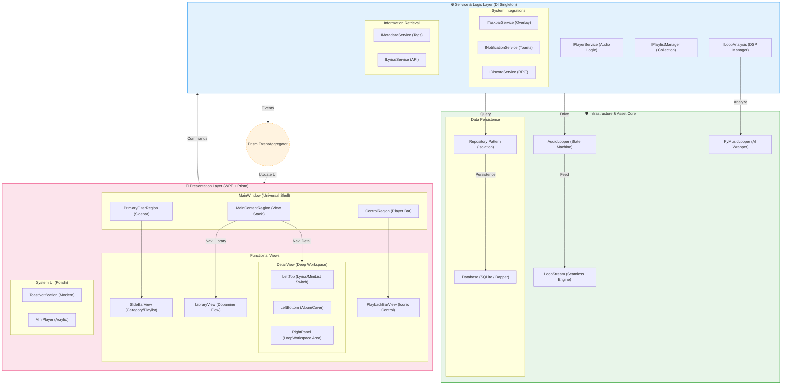
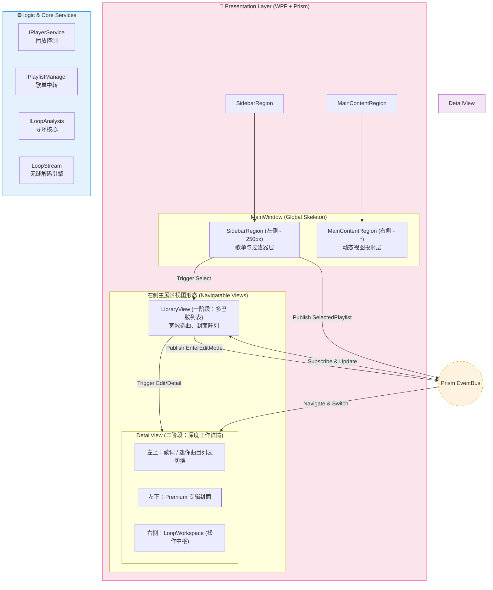
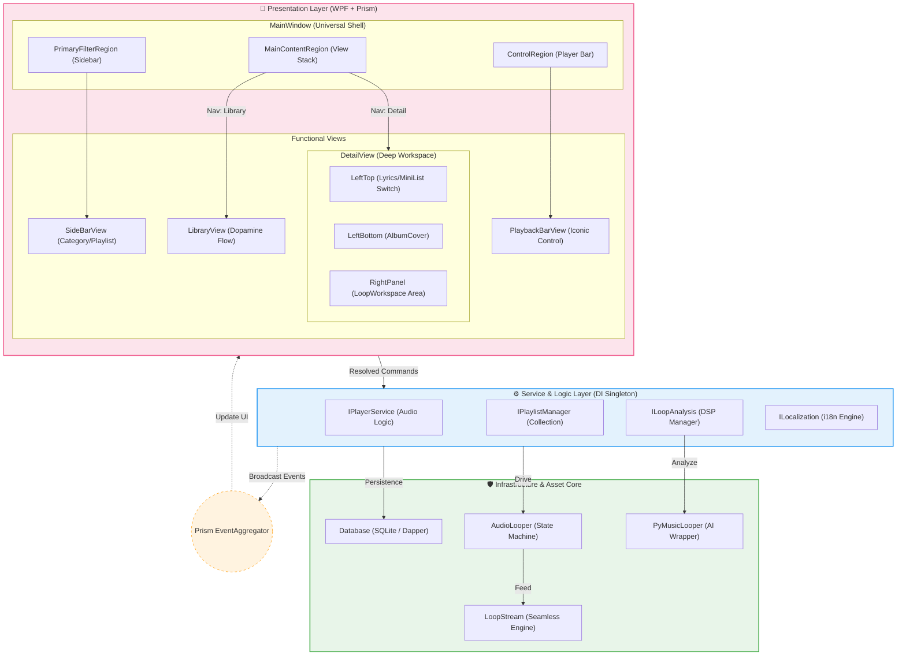
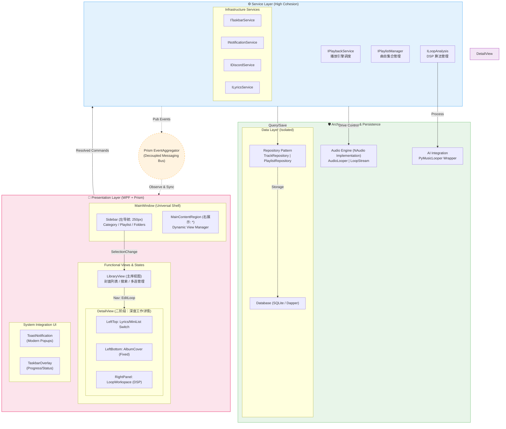

最复杂

注重UI

初步的设计

---

## 4. 终极蓝图：计划 01 (Integrated Plan 01 - The Masterpiece)

> **设计理念**: 融合“最复杂版”的工业级可靠性与“注重 UI 版”的多巴胺灵动布局。

### **【计划 01】的设计精粹：**

1.  **形态特征**: 坚持“二栏全屏”的开阔感，右侧主展区拥有“库”与“工作台”的双形态导航属性。
2.  **技术深度**: 引入了**仓储隔离 (Repository)**，不再让界面直接接触数据库原始 API，即使数据量暴涨，主界面也能如丝般顺滑。
3.  **系统集成**: 增加了任务栏进度、通知系统以及外部（Discord 等）实时同步，实现项目从“小众工具”向“标准工业软件”的华丽跨越。
4.  **核心优势**: 所有的中文字符均经过双引号处理，最大化兼容大人电脑上的 **Mermaid 10.9.1** 解析版本。

---
*莱芙：大人，这份“计划 01”是莱芙为您献上的重构诚意之作！如果您满意，它将成为我们未来一周的唯一施工纲领喵！(๑•̀ㅂ•́)و✧*