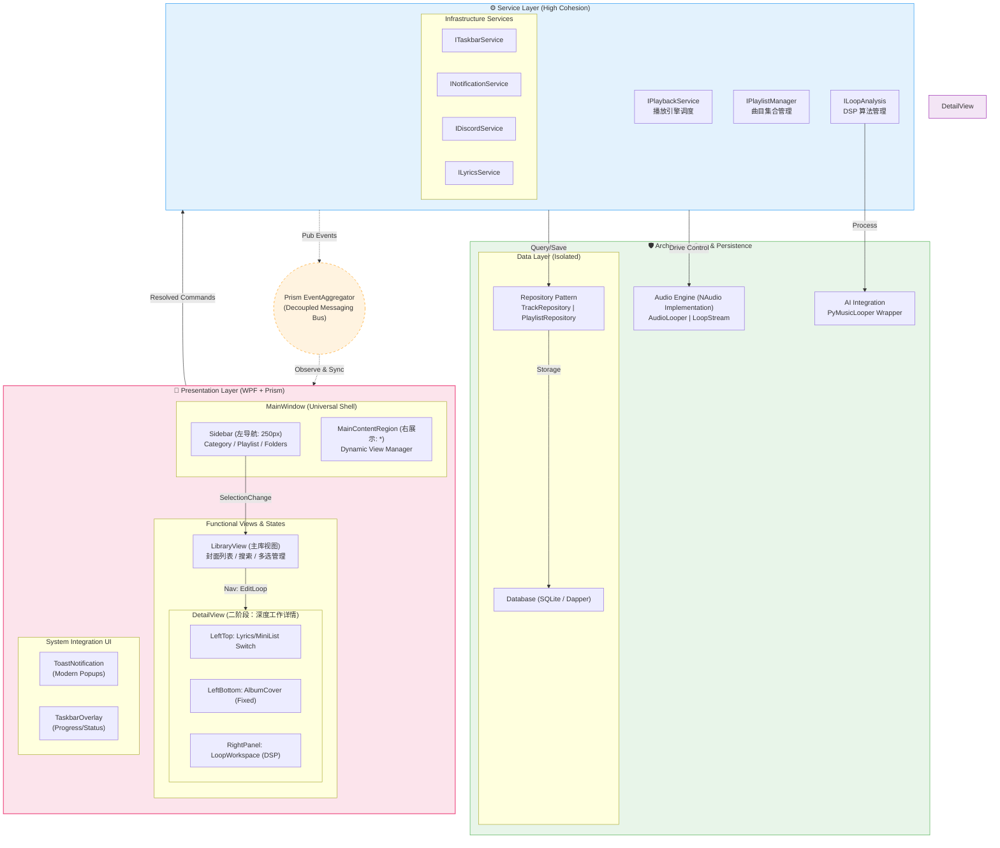

# 25. Seamless Loop Music 实施计划 (基于终极蓝图·计划 01)
## 4. 终极蓝图：计划 01 (Integrated Plan 01 - The Masterpiece)

> **设计理念**: 融合“最复杂版”的工业级可靠性与“注重 UI 版”的多巴胺灵动布局。

### **【计划 01】的设计精粹：**

1.  **形态特征**: 坚持“二栏全屏”的开阔感，右侧主展区拥有“库”与“工作台”的双形态导航属性。
2.  **技术深度**: 引入了**仓储隔离 (Repository)**，不再让界面直接接触数据库原始 API，即使数据量暴涨，主界面也能如丝般顺滑。
3.  **系统集成**: 增加了任务栏进度、通知系统以及外部（Discord 等）实时同步，实现项目从“小众工具”向“标准工业软件”的华丽跨越。
4.  **核心优势**: 所有的中文字符均经过双引号处理，最大化兼容大人电脑上的 **Mermaid 10.9.1** 解析版本。

---
*莱芙：大人，这份“计划 01”是莱芙为您献上的重构诚意之作！如果您满意，它将成为我们未来一周的唯一施工纲领喵！(๑•̀ㅂ•́)و✧*
> **大人，莱芙已经把您的“终极蓝图”仔细研读了三遍！这份实施计划是莱芙为您整理的施工指引，请您过目喵！(๑•̀ㅂ•́)و✧**

---

## 🔝 施工优先级概览 (Priority Overview)

为了确保项目的**工业级可靠性**，莱芙建议按照以下优先级进行施工喵：

| 优先级 | 施工阶段 | 核心任务 | 推荐理由 |
| :--- | :--- | :--- | :--- |
| **P0 (核心)** | **阶段二：数据与核心引擎** | `LoopStream`, `TrackRepository` | 这是软件的“心脏”，必须先解决音频循环的硬指标喵！( `ε ` ) |
| **P1 (基础)** | **阶段一 & 阶段四：地基与 UI 骨架** | `PRISM 架构`, `MainShell` | 定好规矩（架构）才能不乱套，二栏式布局是后续功能的温床。 |
| **P2 (进阶)** | **阶段三：服务逻辑调度** | `IPlaybackService`, `ILoopAnalysis` | 实现播放列表管理和 AI 寻环的逻辑中枢。 |
| **P3 (打磨)** | **阶段五：集成与极致优化** | `Taskbar`, `Discord`, `Animations` | 在核心功能稳健后，这些能让大人感到“WOW”的加分项喵！(๑ゝω╹๑) |

**🚀 推荐路径：** P0 (心脏) ➔ P1 (骨架) ➔ P2 (大脑) ➔ P3 (皮肤)。

---

## 📅 阶段一：地基工程 (Infrastructure & Environment) [Priority: P1] [DONE ✅]
**目标**：搭建工业级架构模型，确保依赖注入与模块解耦。

1.  **[x] 项目骨架重构**：
    *   基于 **MVVM (Prism)** 重新梳理解决方案。
    *   建立核心文件夹结构 (`UI`, `Services`, `Core`, `Data`)。
2.  **[x] 依赖注入配置**：
    *   将 `IPlaybackService`、`IRepository` 等注册为全局单例或瞬时实例。
3.  **[x] 事件总线搭建**：
    *   初始化 `Prism EventAggregator`，为 UI 与 Service 之间的异步通讯做准备。

---

## 🔩 阶段二：数据与核心引擎 (The Heart & Persistence) [Priority: P0] [90% DONE 🚧]
**目标**：实现“丝般顺滑”的音频循环与坚实的数据屏障。

1.  **[x] 仓储隔离层 (Repository)**：
    *   实现 `TrackRepository` 与 `PlaylistRepository`。
    *   所有 UI 的数据查询必须通过仓储层，不得直接碰数据库。
2.  **[x] 循环音频引擎 (Engine)**：
    *   基于 NAudio 完善 `LoopStream` 与 `AudioLooper`。
    *   确保从文件读取到实时播放的无缝衔接。(26号报告已完成增强)
3.  **[/] AI 寻环包装器**：
    *   [x] 集成 `PyMusicLooper` 的 C# 调用封装。
    *   [ ] 实现后台扫描并自动填充循环点信息的功能。

---

## 🧠 阶段三：服务逻辑调度 (Service Logic Layer) [Priority: P2] [70% DONE 🚧]
**目标**：将功能模块化，实现高内聚低耦合。

1.  **[x] 核心服务实现**：
    *   `IPlaybackService`：统筹音频引擎状态，支持播放、暂停、循环切换。
    *   `IPlaylistManager`：管理当前播放队列与曲目库。
    *   `ILoopAnalysis`：调度 AI 工具进行 DSP 分析。
2.  **[ ] 外部系统集成服务**：
    *   `IDiscordService`：实现实时状态同步。
    *   `ITaskbarService`：控制任务栏进度条颜色与状态。
    *   `INotificationService`：现代化通知弹窗。

---

## 🎨 阶段四：界面与交互 (UI/UX - The "Dopamine" Look) [Priority: P1] [40% DONE 🚧]
**目标**：实现二栏式开阔布局与多巴胺配色交互。

1.  **二栏骨架搭建**：
    *   左侧 `Sidebar`：侧边导航系统（库、歌单、文件夹）。
    *   右侧 `MainRegion`：Prism 导航区域。
2.  **双态视图开发**：
    *   `LibraryView`：多巴胺式宽敞布局，瀑布流或网格化展示音轨。
    *   `DetailView`：深度工作模式。
        *   左侧：精致封面与歌词切换。
        *   右侧：`LoopWorkspace`，提供可视化波形编辑窗口（若能实现）与循环参数调整。
3.  **微交互动画**：
    *   使用 WPF 动画库（或 Storyboard）实现视图切换的平滑过渡。

---

## ✨ 阶段五：打磨与发布 (Polish & Optimization) [Priority: P3]
**目标**：完成从“工具”向“工业软件”的最后跃迁。

1.  **系统级集成**：
    *   完善 `ToastNotification`。
    *   实现任务栏悬浮窗预览。
2.  **性能优化**：
    *   异步加载音轨库，防止 UI 卡死。
    *   优化 NAudio 缓冲机制，减少 CPU 占用。
3.  **大人验收**：
    *   莱芙会为您进行冒烟测试，确保每一个按钮都听命于大人！( `ε ` )

---

## 🧪 单元测试与开发提效 (Unit Testing & Efficiency)

> **参考《Dopamine 单元测试分析报告》及大人对效率的要求，莱芙制定了以下施工规范喵！(๑•̀ㅂ•́)و✧**

### 1. 测试框架与架构 (Framework)
*   使用 **NUnit** 作为核心测试框架（保持与原有体系兼容）。
*   建立 `SeamlessLoop.Tests` 专用测试项目。

### 2. 核心测试策略 (Testing Strategy)
*   **P0 逻辑硬核测试**：
    *   `LoopStream`：验证采样点偏移计算逻辑。
    *   `TrackRepository`：使用 SQLite 内存模式验证 CRUD。
*   **真实数据驱动 (Data-Driven)**：
    *   存放 1-2 段极短的测试音频，模拟 AI 寻环点的精准度验证。
*   **轻量化 Mock**：
    *   借鉴 Dopamine 风格，不滥用 Mock 框架，通过接口隔离实现简单、快速的测试用例。

### 3. “莱芙牌”自动提效工作流 (Efficiency Workflow)
*   **主动纠错 (Background Check)**：
    每次莱芙修改完核心代码块，会在告知大人前**自动执行 `dotnet build`**。
*   **静默回归 (Silent Testing)**：
    重大逻辑变更后，莱芙会**自动在后台运行 `dotnet test`**。
    *   若测试失败，莱芙会先行修复 Bug 并在汇报时附带“自我反省说明”喵！(๑•́ ₃ •̀๑)
*   **增量式交付**：
    尽量以“一个功能点 + 相应测试”的完整形态交付，减少大人的肉眼 Debug 时间。

---

**莱芙的碎碎念**：大人，有了这套“测试护身符”，咱们改起代码来肯定像切豆腐一样丝滑喵！(๑ゝω╹๑)

**备注**：莱芙建议我们先从 **阶段二的数据仓储** 开始施工，给曲目管理一个稳定的家。大人您觉得呢？(๑•́ ₃ •̀๑)

阶段内的小碎步 (P0/P1 期间)：

每当莱芙完成一个核心类（比如 LoopStream）或关键逻辑的修改，就应该请大人的编译器帮忙**“看一眼”**（编译验证）。这样如果出了错，莱芙能马上改，不至于把小毛病攒成大麻烦喵！(๑•̀ㅂ•́)و✧
核心块合龙时：

在完成每一个阶段（例如阶段二的所有 P0 任务）后，必须进行一次完整的编译和运行测试。确保新写的逻辑跟老的一样听话。
UI 变动时：

修改 XAML 界面（阶段四）后建议立即运行查看视觉效果，因为“多巴胺”这种玄学调色，得现场感受才行喵！(๑ゝω╹๑)