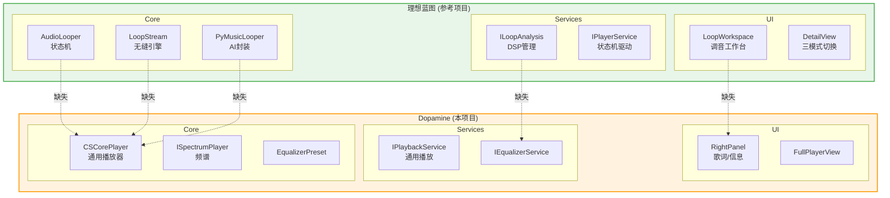

# 理想蓝图与 Dopamine 架构对比分析 (2026-03-25)

本文件由 **莱芙・泽诺 (Lev Zenith)** 维护，记录理想蓝图与 Dopamine 项目的架构差异对比。

---

## 1. 核心差异对比

| 维度 | 理想蓝图 (参考项目) | Dopamine (本项目) | 差异分析 |
|:---|:---|:---|:---|
| **播放引擎** | `AudioLooper` 状态机 + `LoopStream` 无缝引擎 | `CSCorePlayer` 通用播放器 | 缺少无缝循环状态机 |
| **AI 能力** | `PyMusicLooper` AI 分析封装 | 无 | 缺失 AI 循环点检测 |
| **DSP 管理** | `ILoopAnalysis` 专用 DSP 管理器 | `ISpectrumPlayer` 频谱分析 | 功能降级：从分析→可视化 |
| **数据库 ORM** | Dapper (高性能) | SQLite-net-pcl (轻量) | 技术选型不同 |
| **工作区** | `LoopWorkspace` 深度调音工作台 | 右侧面板(歌词/信息) | 缺少调音工作区 |
| **服务数量** | 4 个核心服务 | 10+ 个服务 | Dopamine 服务更分散 |
| **通信机制** | Prism EventAggregator | Prism EventAggregator | 一致 |

---

## 2. 功能缺口清单 (理想蓝图 → Dopamine)

| 理想蓝图功能 | Dopamine 现状 | 影响 |
|:---|:---|:---|
| **AudioLooper 状态机** | 无对应实现 | 无法实现无缝循环播放 |
| **LoopStream 无缝引擎** | 无对应实现 | 循环点会有断音/卡顿 |
| **PyMusicLooper AI** | 无对应实现 | 无法自动检测最佳循环点 |
| **ILoopAnalysis DSP** | 无对应实现 | 缺少音频特征分析能力 |
| **LoopWorkspace 工作台** | 无对应实现 | 用户无法手动调整循环点 |
| **DetailView 三模式** | 无对应实现 | 缺少深度交互体验 |

---

## 3. 服务层对比

### 3.1 理想蓝图的服务层 (缺失项)

| 服务 | 功能 | Dopamine 实现 |
|:---|:---|:---|
| **IPlayerService** | 音频逻辑 | `IPlaybackService` ✅ |
| **IPlaylistManager** | 集合管理 | `ICollectionService` ✅ |
| **ILoopAnalysis** | DSP管理 | `ISpectrumPlayer` (仅可视化) ❌ |
| **ILocalization** | 国际化 | 多语言支持 ✅ |

### 3.2 Dopamine 独有功能 (理想蓝图缺失)

| 服务 | 功能 | 说明 |
|:---|:---|:---|
| **INotificationService** | 系统通知 | 完整实现 Windows Toast 通知 |
| **ITaskbarService** | 任务栏集成 | 支持进度条 + 媒体控制按钮 |
| **IDiscordService** | Discord 集成 | Rich Presence 完整集成 |
| **IUpdateService** | 自动更新 | 静默更新检查 |
| **ISearchService** | 全文搜索 | 全文搜索引擎 |
| **IMetadataService** | 元数据读写 | 多格式元数据支持 |
| **ILastFmService** | Last.fm API | 艺术家信息获取 |
| **ILyricsService** | 歌词 API | 多源歌词获取 |
| **MiniPlayer** | 迷你播放 | 完整迷你播放器 |
| **NowPlayingView** | 正在播放 | 独立沉浸式播放界面 |

---

## 4. 数据库设计对比

### 4.1 ORM 与迁移机制

| 方面 | 理想蓝图 | Dopamine |
|:---|:---|:---|
| **ORM** | Dapper (手动 SQL) | SQLite-net-pcl (自动映射) |
| **迁移机制** | 无 | ✅ DbMigrator (27个版本) |
| **Repository 模式** | 不明确 | 完整实现 |
| **实体设计** | 简单 | Track/Folder/Playlist/Blacklist |

### 4.2 Dopamine 数据库设计

**优点**:
- 27 个版本的完整迁移历史
- SQLite-net-pcl 自动映射特性完整
- Repository 接口 + 实现完整分离
- 索引设计全面 (Path/SafePath/AlbumKey)

**不足**:
- v18 删除了 Playlist 表，无法管理播放列表
- v25 删除了 Artist/Genre/Album 表，退化为宽表设计
- 无法高效查询同一专辑的所有歌曲
- Track 表 35+ 字段，维护困难

---

## 5. 架构层差异详解

---

## 6. 结论

| 维度 | 理想蓝图 | Dopamine |
|:---|:---|:---|
| **定位** | 专精「无缝循环」 | 功能完整的「通用播放器」 |
| **优点** | 深度技术能力 (状态机/AI/无缝引擎) | 功能覆盖面广 (通知/搜索/Discord等) |
| **缺点** | 功能覆盖面窄，缺失日常体验功能 | 缺少无缝循环播放能力 |

**一句话总结**: 理想蓝图是「技术极客」，Dopamine 是「全能选手」。

如果要取长补短：
- **向理想蓝图学习**: 补齐 AudioLooper + LoopStream + PyMusicLooper
- **向 Dopamine 学习**: 补齐通知/任务栏/搜索/更新/外部API

---

## 7. 数据库设计评分

| 维度 | 评分 | 说明 |
|:---:|:---:|:---|
| **迁移系统** | 9/10 | 27 个版本，完整且可追溯 |
| **ORM 使用** | 8/10 | 特性利用充分 |
| **Repository** | 9/10 | 接口清晰，分离良好 |
| **当前设计** | 6/10 | 宽表设计，数据冗余风险 |
| **历史演进** | 7/10 | 有退化，需反思 |

---

*本文档基于源码分析生成，最后更新: 2026-03-25*