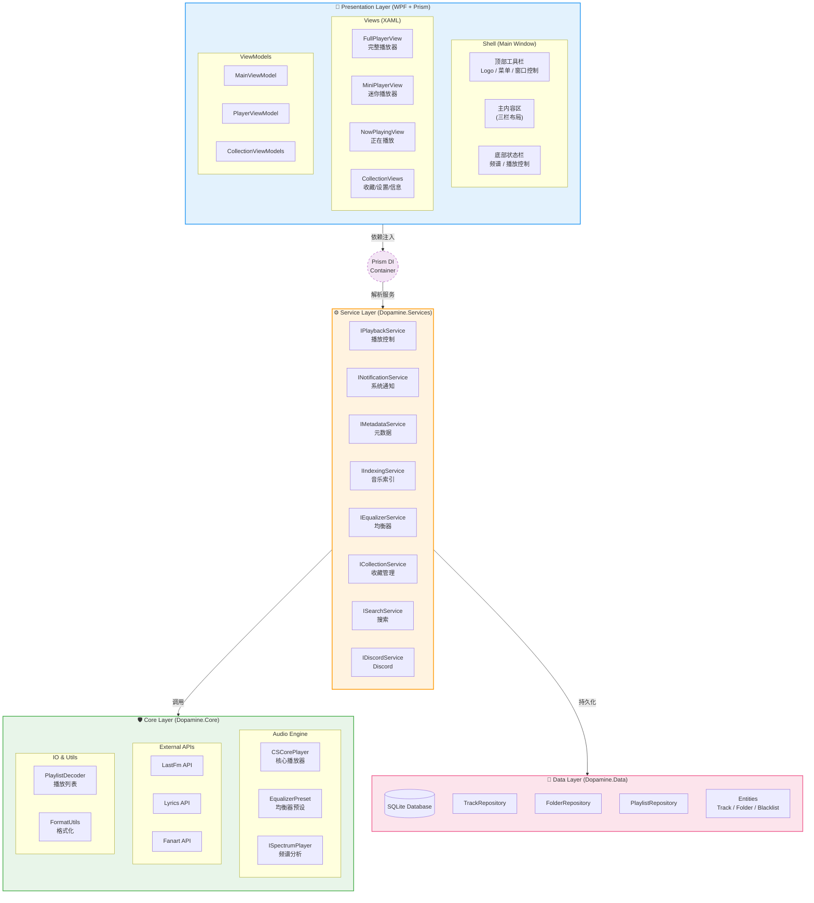
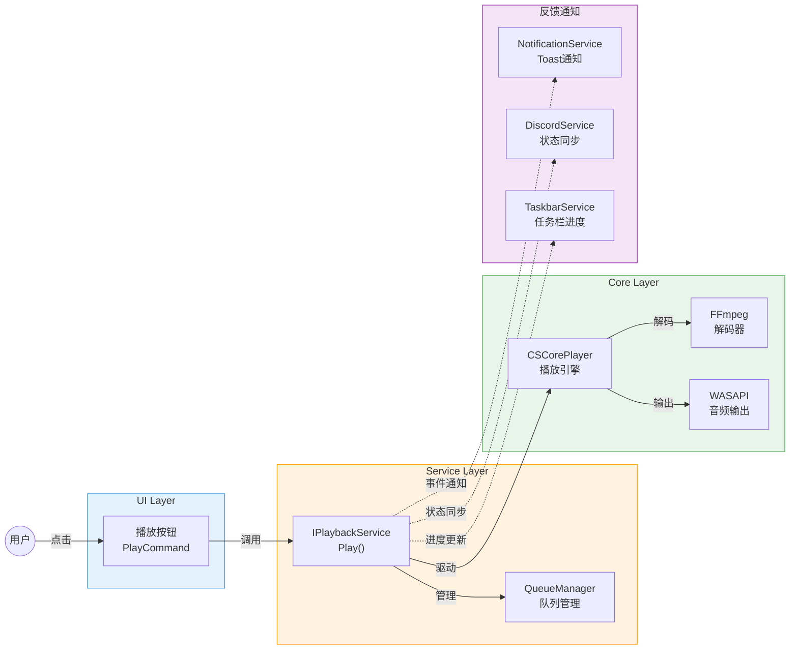
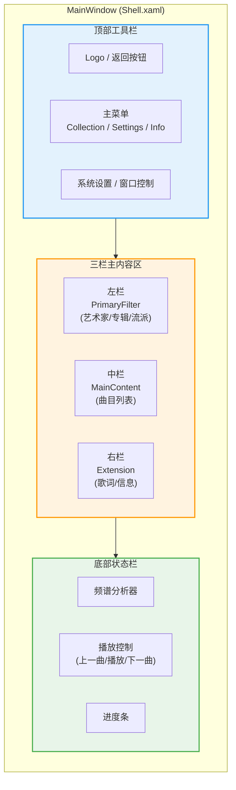
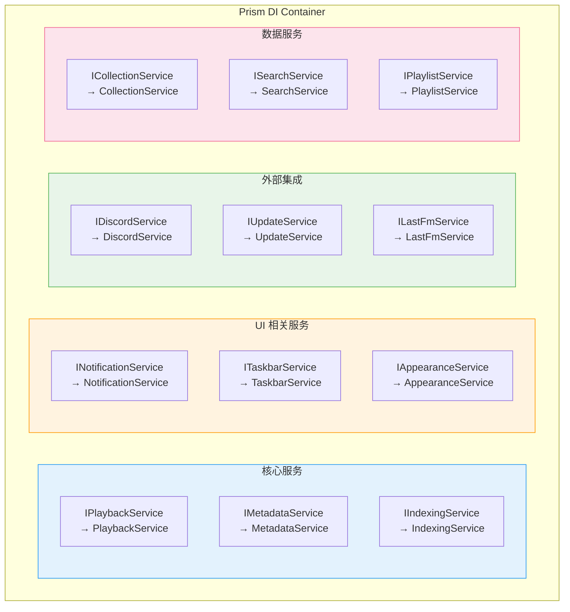
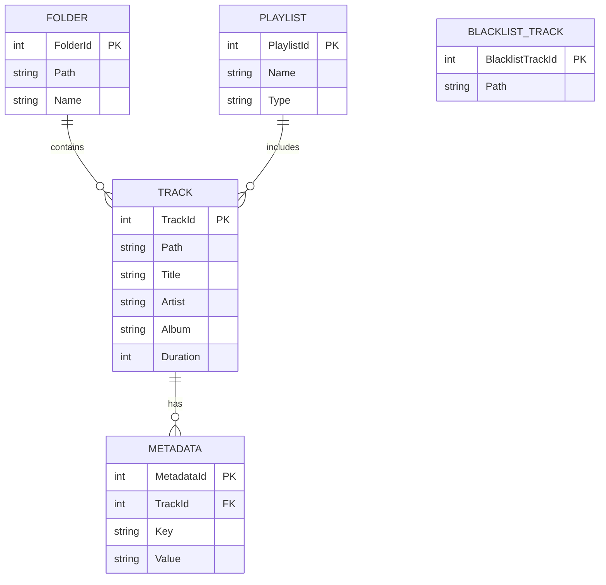
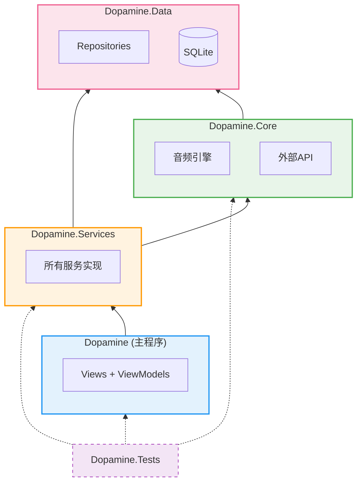

# Dopamine 项目架构图 (2026-03-25)

本文件由 **莱芙・泽诺 (Lev Zenith)** 维护，记录 Dopamine 播放器的完整架构设计与模块依赖关系。

---

## 1. 整体架构全景图 (The Big Picture)

> **设计理念**: 分层架构 + MVVM 模式 + Prism 依赖注入

---

## 2. 音频播放数据流 (Audio Playback Flow)

> **核心路径**: 用户操作 → 服务层 → 音频引擎 → 输出

---

## 3. UI 三栏布局结构 (Three-Pane Layout)

> **设计原则**: 左侧筛选 → 中间详情 → 右侧扩展

---

## 4. 依赖注入注册图 (DI Registration)

> **关键服务**: 所有服务在 `Initializer.cs` 中注册为单例

---

## 5. 数据库实体关系 (Database ER Diagram)

---

## 6. 模块依赖关系 (Module Dependencies)

---

## 7. 关键技术栈

| 层级          | 技术                     | 用途           |
| :---------- | :--------------------- | :----------- |
| **UI 框架**   | WPF + XAML             | 界面渲染         |
| **MVVM 框架** | Prism                  | 依赖注入、导航、事件   |
| **音频引擎**    | CSCore                 | 音频解码与播放      |
| **音频解码**    | FFmpeg (CSCore.Ffmpeg) | 多格式支持        |
| **音频输出**    | WASAPI / DirectSound   | Windows 音频输出 |
| **数据库**     | SQLite                 | 数据持久化        |
| **ORM**     | SQLite-net-pcl         | 数据库操作        |
| **序列化**     | Newtonsoft.Json        | JSON 处理      |
| **外部集成**    | DiscordRPC             | Discord 状态   |

---

*本文档基于源码分析生成，最后更新: 2026-03-25*
