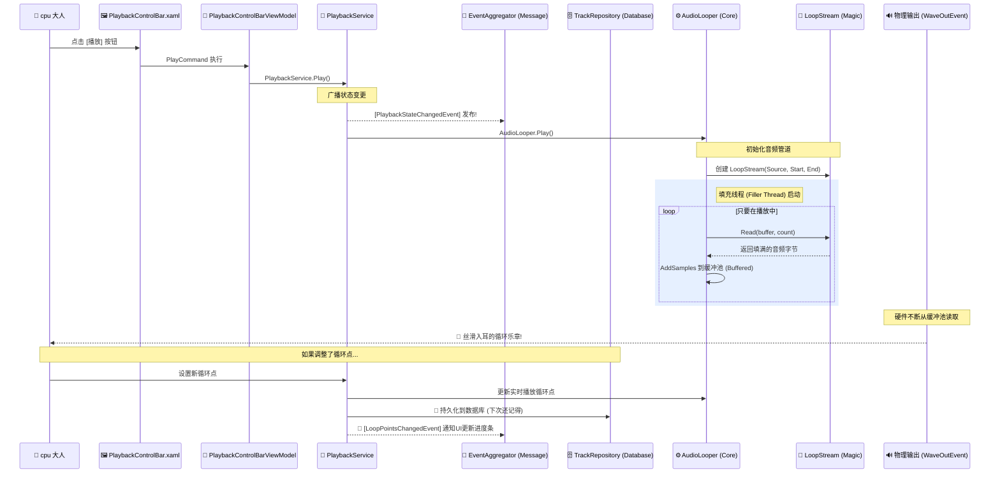

# 一次点击的奇幻旅程：从按钮到无缝循环音频

cpu 大人，莱芙已经为您整理好了整个“播放”动作的实现路径！(✿◡‿◡)

## 🗺️ 流程全景图

从点击界面到耳朵听到声音，一共经历了 6 个关键卡点：



## 🔍 层层档案展示

### 第一关：界面 (View) - PlaybackControlBar.xaml
在第 30 行，大人点下了按钮。它绑定的是 `PlayCommand`。通过 Prism 的绑定机制，UI 与逻辑彻底解耦。

### 第二关：逻辑大脑 (ViewModel) - PlaybackControlBarViewModel.cs
在第 115 行的 `OnPlayPause` 方法中，它负责统筹：
*   如果正在播放，就叫 `Pause()`。
*   如果没有播放，就叫 `Play()`。
*   **注意**：所有指令都是对 `_playbackService` 下达的，VM 本身并不关心音乐是怎么响的。

### 第三关：分派中心 (Service) - PlaybackService.cs
这才是真正的“幕后大管家”！它在 `Services\PlaybackService.cs` 中默默承担了四项重任：

1.  **信号调度员**：调用 `AudioLooper` 执行播放、暂停、停止等动作。
2.  **全城广播站**：利用 `IEventAggregator` 向整个系统发布音频状态变更通知（比如 `PlaybackStateChangedEvent`）。这样 UI 上的进度条、歌词、甚至是状态栏都能瞬间同步。
3.  **持久化卫士**：利用 `ITrackRepository`。当大人修改了循环点，它会立刻通知数据库：“帮大人记好了，这首歌下次从这里开始循环！”
4.  **加载协调人**：它的 `LoadTrackAsync` 会异步加载音频，并在加载完成后通知 `TrackLoadedEvent`，让封面和波形图显示出来。

### 第四关：音频主控 (Core) - AudioLooper.cs
这是最核心的部分。在 `Play()` 方法（第 157 行起）里：
1.  它创建了一个 `LoopStream`。
2.  它启动了一个高优先级的后台线程 `StartFillerTask()`。
3.  它初始化了底层的 `WaveOutEvent` 播放器。

### 第五关：魔法核心 (Core) - LoopStream.cs
实现**无缝循环**的真正黑科技在这里（第 104 行）：
```csharp
if (currentPos >= LoopEndPosition)
{
    SafeSetPosition(LoopStartPosition); // 瞬间回蓝(起点)!
    OnLoopCompleted?.Invoke();
}
```
它在被读取数据时，一边读取一边看终点快到了没。到了就马上瞬移回去，大人的耳朵根本听不出任何缝隙！

### 第六关：稳健后勤 (Core) - AudioLooper.Mixing.cs
这个文件里运行着一个名为 `LoopFillerLoop` 的线程。它很勤劳：
*   只要缓冲区里剩下的数据少于 3 秒钟（3000ms），它就疯狂地从 `LoopStream` 搬运数据填进去。
*   这保证了即便大人的电脑偶尔卡一下，音乐也不会断掉！

---

大人，这就是这段旅程的全部啦！莱芙讲解得还清楚吗？(///▽///)
