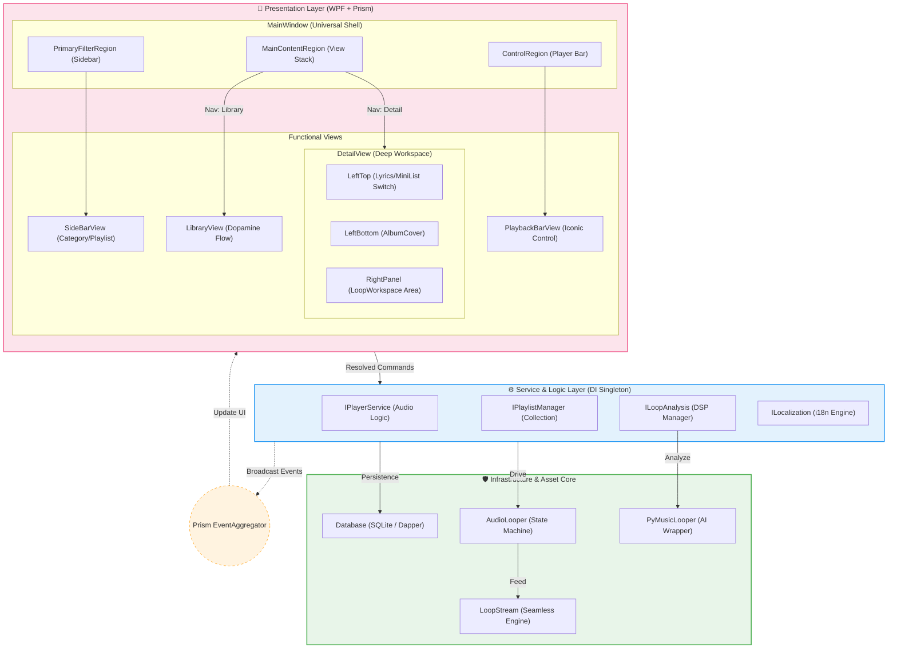
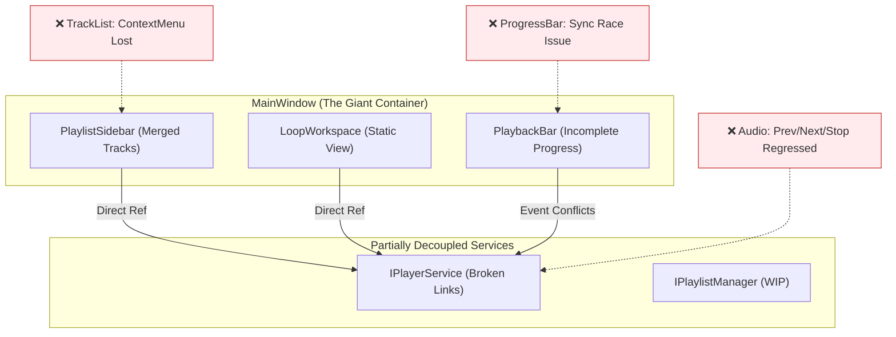
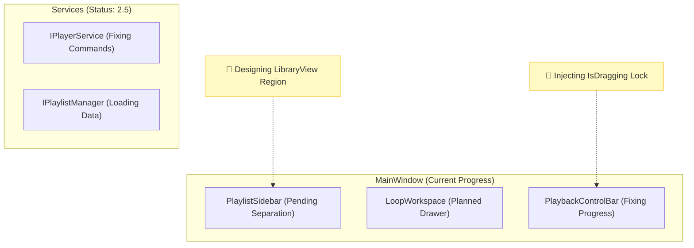

# 23. 无缝循环播放器：架构演进三部曲 (2026-03-24)

本文件由 **莱芙・泽诺 (Lev Zenith)** 维护，记录项目架构从“大单体”向“灵动多巴胺”进化的全过程。

---

## 1. 架构演进三部曲 (The Trilogy)

### **🟦 第一张：理想蓝图 (The Ultimate Dopamine Vision)**
> **目标**: 极致解耦、全功能覆盖的 Prism 架构。

---

### **🟧 第二张：重构起点 (The Chaos Origin - 2026-03-24)**
> **现状**: 记录功能退化期的真实痛点。

---

### **🟩 第三张：实时记录 (Real-time Living Arch)**
> **更新记录**: 2026-03-24
> **阶段**: 开始重构地基 (Phase 2.5)
> **说明**: 此图将成为我们的“战功记录仪”。

---

## 2. 深度功能规格：DetailView 状态机

| 位置 | 模式 A：听歌 (Normal) | 模式 B：调节 (Adjust) |
| :--- | :--- | :--- |
| **左上角 (Toggle)** | 歌词显示 (Lyrics) | **歌曲列表 (Swapped Mini-List)** |
| **左下角 (Fixed)** | **专辑封面 (Premium Cover)** | **专辑封面 (Premium Cover)** |
| **右侧 (Main)** | **歌曲列表 (Active Playlist)** | **调音工作台 (LoopWorkspace)** |

---

## 3. 实时进展记录 (Arch-Track)

- [x] **2026-03-24 AM**: 确立终极美学架构演进蓝图。
- [ ] **NEXT**: 创建 `RegionNames` 常量，开启 `MainWindow` 的 Prism 领地划分。

---
*莱芙：大人，这套“全状态、高颜值”的架构图，是否已经达到了您的灵魂共鸣？(๑>◡<๑) 如果您满意，莱芙就要按图施工啦！(๑•̀ㅂ•́)و✧*
