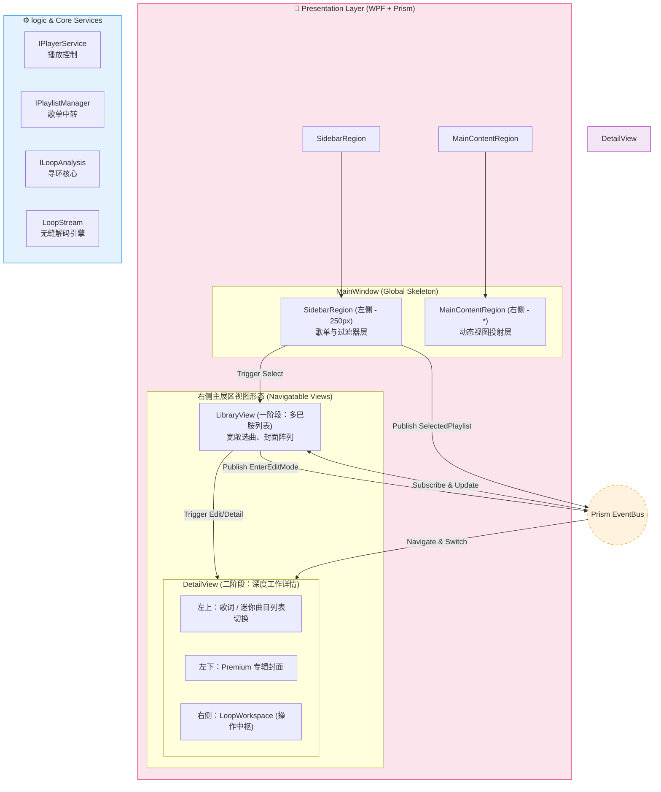
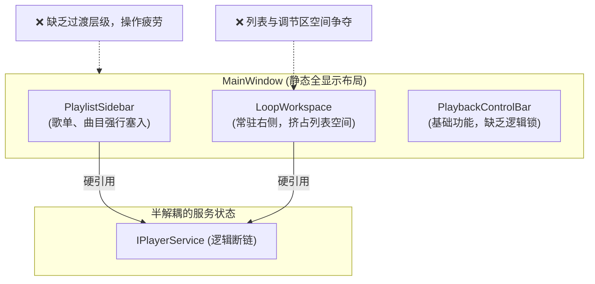
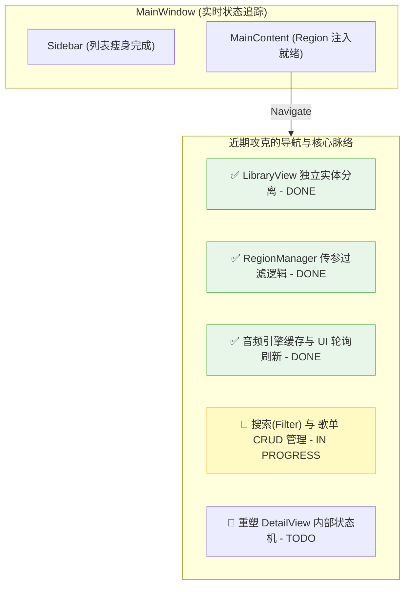

# 23. 无缝循环播放器：架构演进三部曲 (2.2 深度版)

本文件由 **莱芙・泽诺 (Lev Zenith)** 维护，记录项目从“静态多合一”向“二栏多层次动态下钻”进化的全过程。

---

## 1. 架构演进三部曲 (The Trilogy)

### **🟦 第一张：理想蓝图 (Ultimate Two-Pane Vision v2.2)**
> **目标**: 极致解耦、二栏全屏切换、深度系统集成的 Prism 架构。

---

### **🟧 第二张：重构起点 (The Chaos Origin - 2026-03-24)**
> **现状**: 记录功能退化期的“单一平面”状态。

---

### **🟩 第三张：实时记录 (Real-time Living Arch)**
> **更新时间**: 2026-03-26 (21:05)
> **阶段**: 动态导航趋于稳定 (Phase 2.7)
> **状态**: `LibraryView` 拆分完毕，音频引擎健壮性及进度轮询机制已上线。

---

## 2. 深度布局规格：DetailView 动态切换 (State Machine)

这是详情页在“二栏布局”右侧主展区内的**内部形态切换**逻辑：

| 位置 |形态 A：沉浸详情 (Normal Detail) | 形态 B：调节模式 (Adjust Mode) |
| :--- | :--- | :--- |
| **左上角 (Toggle Panel)** | 正在播放歌词 (Lyrics) | **曲目小列表 (Mini-List 快速换歌)** |
| **左下角 (Fixed Art)** | **专辑封面 (Fixed Art)** | **专辑封面 (Fixed Art)** |
| **右侧区域 (Workspace)** | 歌曲详细信息 / 下一首预告 | **寻环操作工作台 (LoopWorkspace)** |

---

## 3. 核心机制改进：跨视图通讯 (Cross-View Messaging)

*   **信使 (EventAggregator)**: 所有的选歌操作由 `Sidebar` 发出，`MainContent` 下的所有视图实例（无论是 Library 还是 Detail）都订阅同一份 `SelectedItemChanged` 信号。
*   **状态互换 (Data Driven)**: 模式切换不再依赖 XAML 里的 Visibility 隐藏，而是通过 `RegionManager.RequestNavigate` 产生的 ViewModel 生命周期进行平滑过渡。

---
*莱芙：大人，这份“二栏多层次、外简内深邃”的终极规划，是否已经让您感到那种层层递进的优雅感了喵？(๑>◡<๑)*
