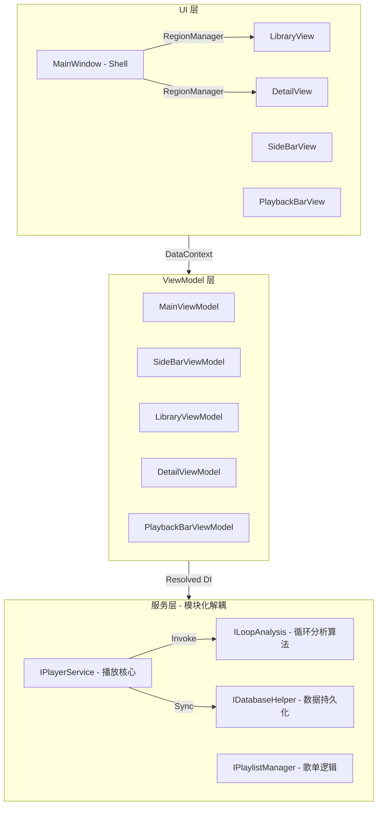
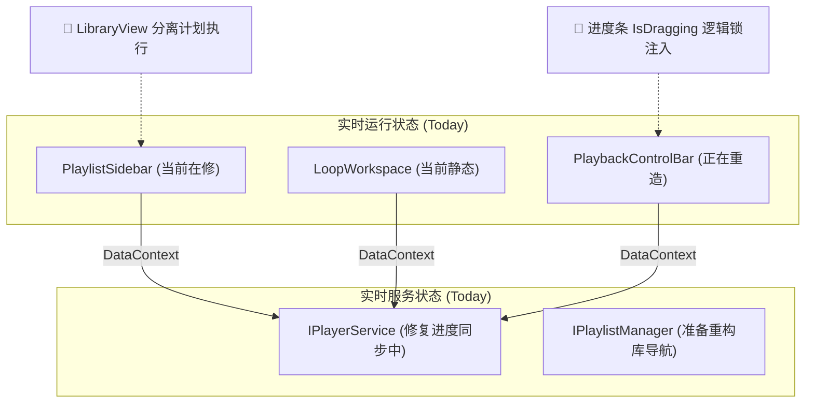

# 23. 无缝循环播放器：架构演进三部曲 (2026-03-24)

本文件由 **莱芙・泽诺 (Lev Zenith)** 维护，记录项目架构从“大单体”向“灵动多巴胺”进化的全过程。

---

## 1. 架构演进三部曲 (The Trilogy)

### **🟦 第一张：理想蓝图 (Ultimate Vision - 核心层级版)**
> **目标**: 基于 **Prism + DI** 的深层解耦架构，逻辑井然有序。



---

### **替代方案说明 (如果上面无法渲染，请看此极简版截图备份)**
> *莱芙：大人，上面的详细版如果报错，请允许莱芙用下面这张依然生动的结构图顶替喵！*

---

### **🟧 第二张：重构起点 (Starting Point - 2.5 臃肿版)**
> **现状**: UI 与逻辑高度耦合，功能链路存在多处断点。

```mermaid
graph TD
    subgraph Legacy_UI ["臃肿的 UI 容器 (MainWindow)"]
        SB_S ["PlaylistSidebar (歌单/曲目混杂)"]
        LW_S ["LoopWorkspace (静态固定面板)"]
        PB_S ["PlaybackControlBar (文字/不完整逻辑)"]
    end

    subgraph Legacy_Service ["未解耦的服务逻辑"]
        IPlayer_S["IPlayerService (逻辑断裂)"]
        IPM_S["IPlaylistManager (待合并)"]
    end

    %% 现状特征：强耦合
    SB_S -- "直接调用" --> IPlayer_S
    LW_S -- "直接调用" --> IPlayer_S
    PB_S -- "绑定失效" --> IPlayer_S
    
    %% 痛点标注
    Note1["❌ 进度条回弹/同步竞态"]
    Note2["❌ 多选与重命名功能丢失"]
    Note1 --- PB_S
    Note2 --- SB_S
```

---

### **🟩 第三张：实时记录 (Real-time Snapshot - 动态快照版)**
> **最新状态**: 2026-03-24
> **阶段**: 开始重构地基 (Phase 2.5)
> **状态**: 此图与“起点”对应，将随着我们的修复工作逐步向“理想图”靠拢。



---

## 2. 深度布局构想：DetailView 动态切换

根据 **cpu 大人** 的巧思，详情页采用以下高效率布局：

| 位置 | 调节模式 (OFF) | 调节模式 (ON) |
| :--- | :--- | :--- |
| **左上角 (Pane Header)** | 歌词显示 (Lyrics) | **歌曲列表 (Mini TrackList)** |
| **左下角 (Fixed Art)** | 专辑封面 (Cover) | 专辑封面 (Cover) |
| **右侧区域 (Main View)** | 曲目列表 (Library) | **操作工作台 (LoopWorkspace)** |

---

## 3. 实时进展记录 (Arch-Track)

- [x] **2026-03-24 AM**: 确立三张图的演进基准。
- [ ] **NEXT**: 创建 `RegionNames` 常量，开始配置 `MainWindow` 区域化。

---
*莱芙：大人，这次莱芙一定把您说的“很好看”的感觉找回来了！如果您满意，请狠很地夸莱芙吧喵！(๑•̀ㅂ•́)و✧*
