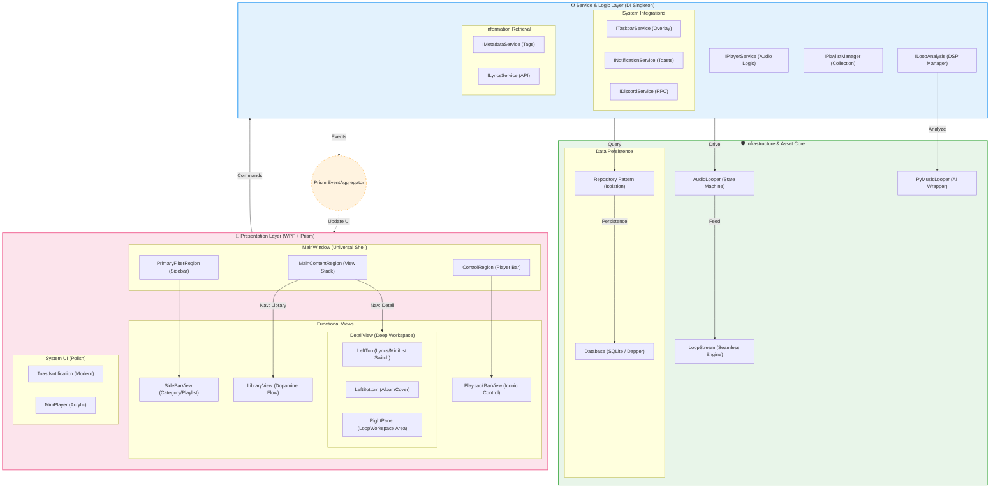
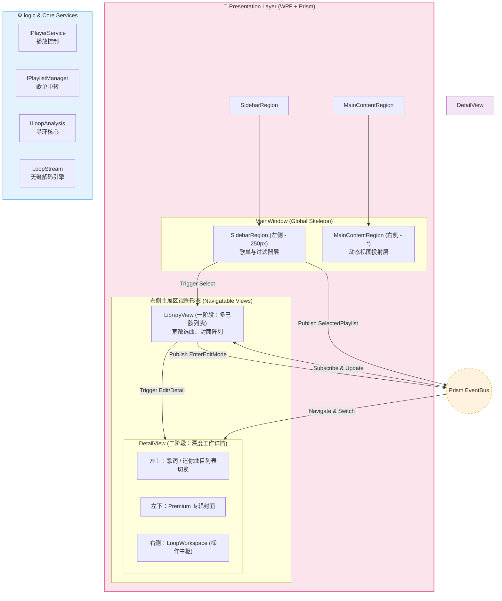
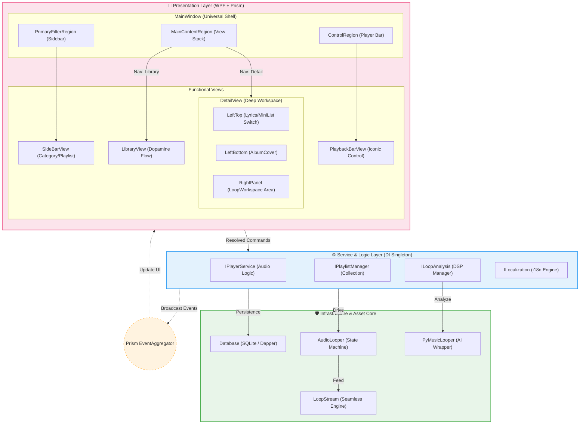

最复杂

```mermaid
graph TD
    %% 展示层：采用层级嵌套
    subgraph UI_Layer ["🎨 Presentation Layer (WPF + Prism)"]
        direction TB
        subgraph Shell ["MainWindow (Universal Shell)"]
            R1["PrimaryFilterRegion (Sidebar)"]
            R2["MainContentRegion (View Stack)"]
            R3["ControlRegion (Player Bar)"]
        end
        
        subgraph Views ["Functional Views"]
            SBV["SideBarView (Category/Playlist)"]
            LVV["LibraryView (Dopamine Flow)"]
            PCV["PlaybackBarView (Iconic Control)"]
            
            subgraph DV ["DetailView (Deep Workspace)"]
                LT["LeftTop (Lyrics/MiniList Switch)"]
                LB["LeftBottom (AlbumCover)"]
                RW["RightPanel (LoopWorkspace Area)"]
            end
        end
        
        subgraph Ext ["System UI (Polish)"]
            NV["ToastNotification (Modern)"]
            MV["MiniPlayer (Acrylic)"]
        end
        
        R1 --> SBV
        R2 -- "Nav: Library" --> LVV
        R2 -- "Nav: Detail" --> DV
        R3 --> PCV
    end

    %% 服务层：逻辑中枢
    subgraph Service_Layer ["⚙️ Service & Logic Layer (DI Singleton)"]
        direction LR
        PS["IPlayerService (Audio Logic)"]
        PMS["IPlaylistManager (Collection)"]
        
        subgraph SysSrv ["System Integrations"]
            ITS["ITaskbarService (Overlay)"]
            INS["INotificationService (Toasts)"]
            IDS["IDiscordService (RPC)"]
        end
        
        subgraph MetaSrv ["Information Retrieval"]
            IMS["IMetadataService (Tags)"]
            ILS["ILyricsService (API)"]
        end
        
        LAS["ILoopAnalysis (DSP Manager)"]
    end

    %% 核心层：基础设施
    subgraph Infrastructure ["🛡️ Infrastructure & Asset Core"]
        direction TB
        AL["AudioLooper (State Machine)"]
        Str["LoopStream (Seamless Engine)"]
        
        subgraph Data ["Data Persistence"]
            RP["Repository Pattern (Isolation)"]
            DB["Database (SQLite / Dapper)"]
        end
        
        PyW["PyMusicLooper (AI Wrapper)"]
    end

    %% 通讯机制
    Bus(("Prism EventAggregator"))

    %% 数据与指令流
    UI_Layer -- "Commands" --> Service_Layer
    Service_Layer -- "Drive" --> AL
    AL -- "Feed" --> Str
    
    Service_Layer -- "Query" --> RP
    RP -- "Persistence" --> DB
    
    LAS -- "Analyze" --> PyW
    
    %% 消息传递
    Service_Layer -. "Events" .-> Bus
    Bus -. "Update UI" .-> UI_Layer

    %% 视觉美化方案
    style UI_Layer fill:#fce4ec,stroke:#f06292,stroke-width:2px
    style Service_Layer fill:#e3f2fd,stroke:#2196f3,stroke-width:2px
    style Infrastructure fill:#e8f5e9,stroke:#4caf50,stroke-width:2px
    style Bus fill:#fff3e0,stroke:#ff9800,stroke-dasharray: 5 5
```
注重UI

```mermaid
graph TD
    %% 展示层：二栏全局骨架
    subgraph UI_Layer ["🎨 Presentation Layer (WPF + Prism)"]
        direction TB
        subgraph Shell ["MainWindow (Global Skeleton)"]
            direction LR
            Sidebar["SidebarRegion (左侧 - 250px)\n歌单与过滤器层"]
            MainRegion["MainContentRegion (右侧 - *)\n动态视图投射层"]
        end
        
        subgraph View_States ["右侧主展区视图形态 (Navigatable Views)"]
            direction TB
            LV["LibraryView (一阶段：多巴胺列表)\n宽敞选曲、封面阵列"]
            
            subgraph DV ["DetailView (二阶段：深度工作详情)"]
                LT["左上：歌词 / 迷你曲目列表切换"]
                LB["左下：Premium 专辑封面"]
                RW["右侧：LoopWorkspace (操作中枢)"]
            end
        end
        
        Sidebar -- "Trigger Select" --> LV
        LV -- "Trigger Edit/Detail" --> DV
        SidebarRegion --> Sidebar
        MainContentRegion --> MainRegion
    end

    %% 服务层与核心层
    subgraph Logic_Core ["⚙️ logic & Core Services"]
        PS["IPlayerService\n播放控制"]
        PMS["IPlaylistManager\n歌单中转"]
        LAS["ILoopAnalysis\n寻环核心"]
        Str["LoopStream\n无缝解码引擎"]
    end

    %% 消息机制
    Bus(("Prism EventBus"))

    %% 数据驱动流
    Sidebar -- "Publish SelectedPlaylist" --> Bus
    Bus -- "Subscribe & Update" --> LV
    LV -- "Publish EnterEditMode" --> Bus
    Bus -- "Navigate & Switch" --> DV
    
    style UI_Layer fill:#fce4ec,stroke:#f06292,stroke-width:2px
    style DetailView fill:#f3e5f5,stroke:#9c27b0
    style Logic_Core fill:#e3f2fd,stroke:#2196f3
    style Bus fill:#fff3e0,stroke:#ff9800,stroke-dasharray: 5 5
```

初步的设计

```mermaid
graph TD
    %% 展示层：采用层级嵌套
    subgraph UI_Layer ["🎨 Presentation Layer (WPF + Prism)"]
        direction TB
        subgraph Shell ["MainWindow (Universal Shell)"]
            R1["PrimaryFilterRegion (Sidebar)"]
            R2["MainContentRegion (View Stack)"]
            R3["ControlRegion (Player Bar)"]
        end
        
        subgraph Views ["Functional Views"]
            SBV["SideBarView (Category/Playlist)"]
            LVV["LibraryView (Dopamine Flow)"]
            PCV["PlaybackBarView (Iconic Control)"]
            
            subgraph DV ["DetailView (Deep Workspace)"]
                LT["LeftTop (Lyrics/MiniList Switch)"]
                LB["LeftBottom (AlbumCover)"]
                RW["RightPanel (LoopWorkspace Area)"]
            end
        end
        
        R1 --> SBV
        R2 -- "Nav: Library" --> LVV
        R2 -- "Nav: Detail" --> DV
        R3 --> PCV
    end

    %% 服务层：逻辑中枢
    subgraph Service_Layer ["⚙️ Service & Logic Layer (DI Singleton)"]
        direction LR
        PS["IPlayerService (Audio Logic)"]
        PMS["IPlaylistManager (Collection)"]
        LAS["ILoopAnalysis (DSP Manager)"]
        LS["ILocalization (i18n Engine)"]
    end

    %% 核心层：基础设施
    subgraph Infrastructure ["🛡️ Infrastructure & Asset Core"]
        direction TB
        AL["AudioLooper (State Machine)"]
        Str["LoopStream (Seamless Engine)"]
        DB["Database (SQLite / Dapper)"]
        PyW["PyMusicLooper (AI Wrapper)"]
    end

    %% 通讯机制
    Bus(("Prism EventAggregator"))

    %% 数据与指令流
    UI_Layer -- "Resolved Commands" --> Service_Layer
    Service_Layer -- "Drive" --> AL
    AL -- "Feed" --> Str
    Service_Layer -- "Persistence" --> DB
    LAS -- "Analyze" --> PyW
    
    %% 消息传递
    Service_Layer -. "Broadcast Events" .-> Bus
    Bus -. "Update UI" .-> UI_Layer

    %% 视觉美化方案
    style UI_Layer fill:#fce4ec,stroke:#f06292,stroke-width:2px
    style Service_Layer fill:#e3f2fd,stroke:#2196f3,stroke-width:2px
    style Infrastructure fill:#e8f5e9,stroke:#4caf50,stroke-width:2px
    style Bus fill:#fff3e0,stroke:#ff9800,stroke-dasharray: 5 5
```